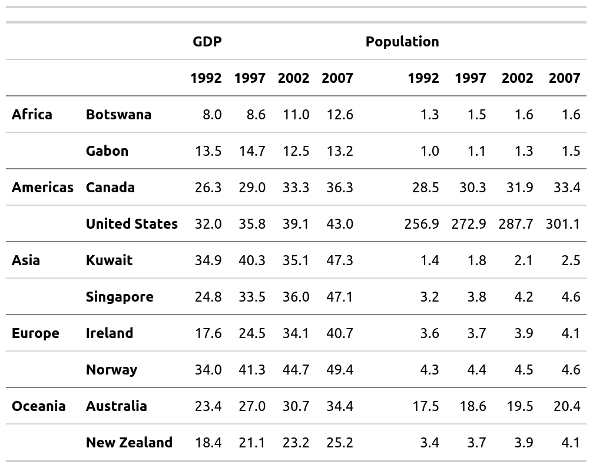
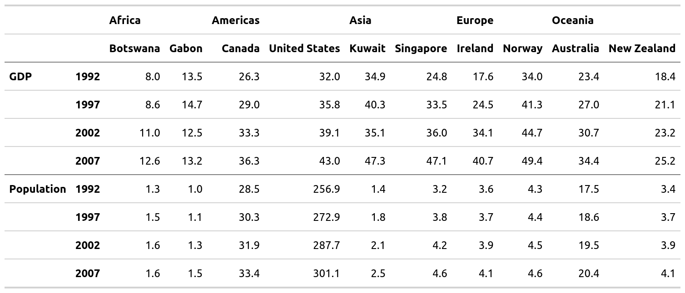
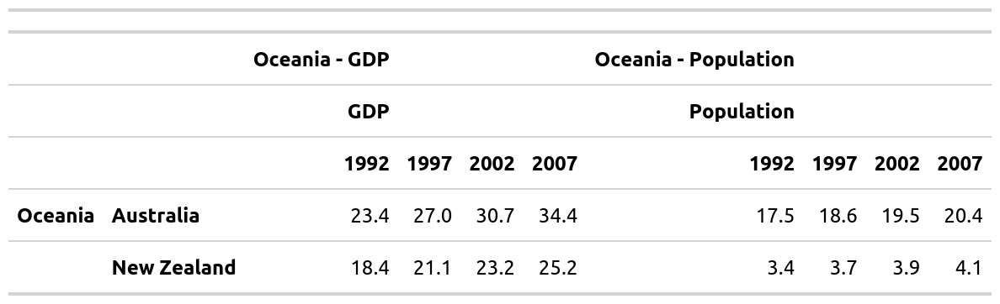
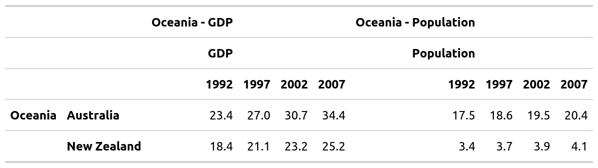
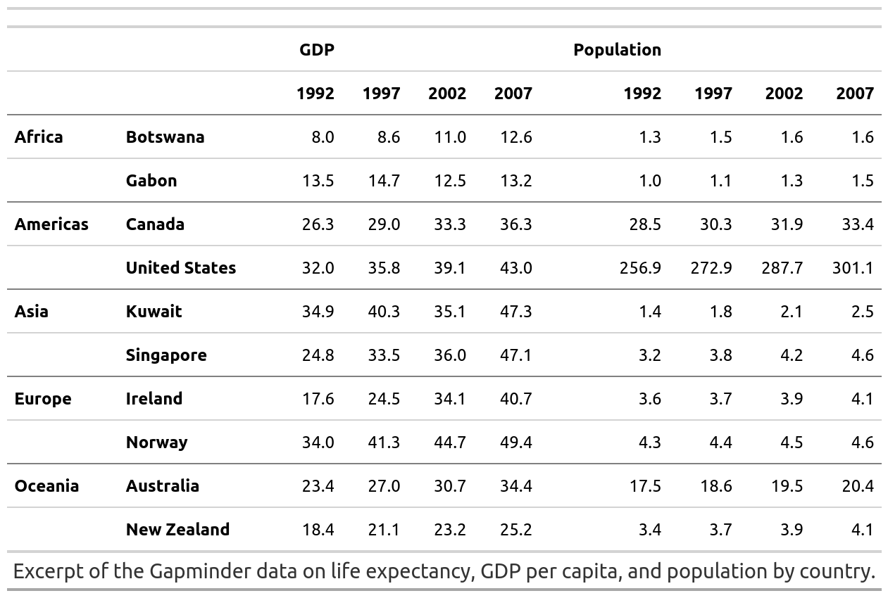
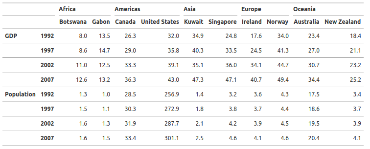
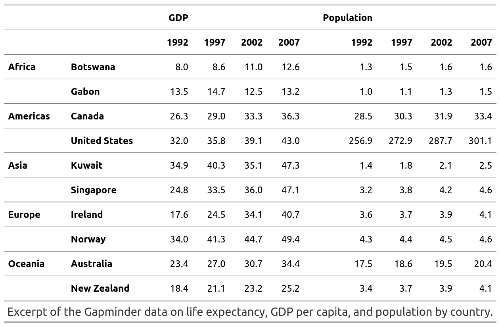

<!-- README.md is generated from README.Rmd. Please edit that file -->

```{r, include = FALSE}
knitr::opts_chunk$set(
  collapse = TRUE,
  comment = "#>",
  fig.path = "man/figures/README-",
  out.width = "100%"
)
```

# mmtable2 <a> </a>
<!-- badges: start -->
[](https://codecov.io/gh/ianmoran11/mmtable2?branch=master)
[](https://github.com/ianmoran11/mmtable2/actions)
[](https://lifecycle.r-lib.org/articles/stages.html#experimental)
<!-- badges: end -->

mmtable2 allows you to create and combine tables with a ggplot2/patchwork syntax.

## Installation

mmtable2 is not available on CRAN. It can be installed from github with the following script:
```{r gh-installation, eval = FALSE}
devtools::install_github("ianmoran11/mmtable2")
```


## Example

```{r example1, echo=TRUE, message=FALSE, warning=FALSE}
library(tidyverse)
library(gapminder)
library(webshot)
library(gt)
library(mmtable2)
```

Here's a GIF demonstrating how to use mmtable2:
```{r echo=FALSE,  message=FALSE, warning=FALSE, out.width = "800px"}
knitr::include_graphics("https://unpivotr.s3.amazonaws.com/01_intro_fast.gif")
```


And here's the code used in the GIF.
```{r message=FALSE, warning=FALSE, echo = T}
row_list <- cells_body(rows = c(1,3,5,7,9,11))
style_list <- list(cell_borders(sides = "top",color = "grey"))
gm_df <- gapminder_mm %>% filter(var != "Life expectancy")

gm_table <- 
 gm_df %>% 
  mmtable(table_data = value) +
  header_top(year) +
  header_left(country) +
  header_top_left(var)  +
  header_left_top(continent)  +
  table_format(
    locations = row_list,
    style = style_list)

gm_table 
```
```{r error=FALSE, message=FALSE, warning=FALSE, include=FALSE, out.width="600px", paged.print=FALSE}
# apply_formats(gm_table) %>% gtsave("./man/figures/gm_table.png")
```
```{r echo=FALSE, message=FALSE, warning=FALSE,error=FALSE, out.width = "600px", paged.print=FALSE}
# 
```


## Adding headers

You can add headers using data from a column in your data frame. 

It's placement will depend on your your choice of header_* functions.

Header options include: top, top_left, left, and left_top. 

Here's a table of the same data used above, this time with a different header layout. 
```{r message=FALSE, warning=FALSE, echo = T}
row_list <- cells_body(rows = c(3,7))
col_list <- cells_body(columns = c(3,5,7,9,11))
style_list <- list(cell_borders(sides = "top",color = "grey"))
style_list2<- list(cell_borders(sides = "left",color = "grey"))
gm_df <- gapminder_mm %>% filter(var != "Life expectancy")
style_list3 = list(cell_text(align = "left"))

gm_table <- 
 gm_df %>% 
  mmtable(table_data = value) +
  header_left(year) +
  header_top(country) +
  header_left_top(var)  +
  header_top_left(continent)  +
  table_format(
    locations = row_list,
    style = style_list) +
  header_format(continent,style_list3 )

gm_table 
```
```{r error=FALSE, message=FALSE, warning=FALSE, include=FALSE, out.width="600px", paged.print=FALSE}
# apply_formats(gm_table) %>% gtsave("./man/figures/gm_table2.png")
```
```{r echo=FALSE, message=FALSE, warning=FALSE,error=FALSE, out.width = "600px", paged.print=FALSE}
# 
```


## Combining tables

You can combine tables with `+`, `/` and `*` operators.
```{r,echo=FALSE, message=FALSE, warning=FALSE, paged.print=FALSE, out.width = "600px"}
create_table <- function(df,name){
 df %>%
   mmtable(table_data = value,table_name = name) +
   header_top(year) +
   header_left(country) +
   header_top_left(var)  +
   header_left_top(continent)
}
```
```{r, echo=FALSE,message=FALSE, warning=FALSE, paged.print=FALSE, out.width = "600px"}
gapminder_tbl <-
 gapminder_mm %>%
 mutate(continent_n = continent, var_n = var) %>%
 group_by(continent_n,var_n) %>% nest() %>%
 ungroup() %>% 
 filter(
   (continent_n == "Oceania" & var_n == "Population") | 
   (continent_n == "Oceania" & var_n == "GDP") |
   (continent_n == "Asia" & var_n == "Population") |
   (continent_n == "Asia" & var_n == "GDP"))  %>% 
 arrange(continent_n,var_n) %>% 
 mutate(name = paste("Table",row_number(), sep =" " )) %>% 
 mutate(table =map2(data,name,create_table))
```
```{r,echo=FALSE, message=FALSE, warning=FALSE, paged.print=FALSE, out.width = "600px"}
t1 <- gapminder_tbl %>% filter(name == "Table 1") %>% pull(table) %>% .[[1]]
t2 <- gapminder_tbl %>% filter(name == "Table 2") %>% pull(table) %>% .[[1]]
t3 <- gapminder_tbl %>% filter(name == "Table 3") %>% pull(table) %>% .[[1]]
t4 <- gapminder_tbl %>% filter(name == "Table 4") %>% pull(table) %>% .[[1]]

```

The `+` operator places tables side-by-side (sharing headers)  
```{r message=FALSE, warning=FALSE, echo = T}
ex1 <- t1 + t2
ex1 
```
```{r error=FALSE, message=FALSE, warning=FALSE, include=FALSE, out.width="600px", paged.print=FALSE}
# apply_formats(ex1) %>% gtsave("./man/figures/ex1.png")
```
```{r echo=FALSE, message=FALSE, warning=FALSE,error=FALSE, out.width = "600px", paged.print=FALSE}
# 
```


The `/` operator places tables on top of one another (sharing headers)  
```{r message=FALSE, warning=FALSE, echo = T}
ex2 <- t1 / t3
ex2 
```
```{r error=FALSE, message=FALSE, warning=FALSE, include=FALSE, out.width="600px", paged.print=FALSE}
# apply_formats(ex2) %>% gtsave("./man/figures/ex2.png")
```
```{r echo=FALSE, message=FALSE, warning=FALSE,error=FALSE, out.width = "600px", paged.print=FALSE}
# 
```

The `*` operator "integrates" tables  
```{r message=FALSE, warning=FALSE, echo = T}
ex3 <- t1 * t3 * t4 *  t2
ex3 
```
```{r error=FALSE, message=FALSE, warning=FALSE, include=FALSE, out.width="600px", paged.print=FALSE}
# apply_formats(ex3) %>% gtsave("./man/figures/ex3.png")
```
```{r echo=FALSE, message=FALSE, warning=FALSE,error=FALSE, out.width = "600px", paged.print=FALSE}
# 
```


## Formatting tables

mmtable2 outputs tables using the gt package's format.

This means you can alter formatting using many existing gt styling commands.
```{r message=FALSE, warning=FALSE, echo = T}
gm_table_formatted <- 
gapminder_mm %>% 
  filter(var != "Life expectancy") %>% 
  mmtable(table_data = value) +
  header_top(year) +
  header_left(country) +
  header_top_left(var)  +
  header_left_top(continent)  +
  cells_format(cell_predicate = T, style = list(cell_text(align = "right"))) +
  header_format(header = year, style = list(cell_text(align = "right"))) +
  header_format("all_cols", style = list(cell_text(weight = "bolder"))) +
  header_format("all_rows", style = list(cell_text(weight = "bolder"))) +
  table_format(
    locations = cells_body(rows = c(1,3,5,7,9,11)),
    style = list(cell_borders(sides = "top",color = "grey"))) + 
  table_source_note(source_note = "Excerpt of the Gapminder data on life expectancy, GDP per capita, and population by country." )

gm_table_formatted
```
```{r error=FALSE, message=FALSE, warning=FALSE, include=FALSE, out.width="600px", paged.print=FALSE}
# apply_formats(gm_table_formatted) %>% gtsave("./man/figures/gm_table_formatted.png")
```
```{r echo=FALSE, message=FALSE, warning=FALSE,error=FALSE, out.width = "600px", paged.print=FALSE}
# 
```


### Merged header columns 

Table headers can be merged with `header_merged_cols()`. 
This supports an aributrary number of column headers. 
```{r message=FALSE, warning=FALSE, echo = T}
row_list <- cells_body(rows = c(3,7))
col_list <- cells_body(columns = c(3,5,7,9,11))
style_list <- list(cell_borders(sides = "top",color = "grey"))
style_list2<- list(cell_borders(sides = "left",color = "grey"))
gm_df <- gapminder_mm %>% filter(var != "Life expectancy")
style_list3 = list(cell_text(align = "left"))

gm_table_merged <- 
 gm_df %>% 
  mmtable(table_data = value) +
  header_left(year) +
  header_top(country) +
  header_left_top(var)  +
  header_top_left(continent)  +
  table_format(
    locations = row_list,
    style = style_list) +
  header_format(continent,style_list3 ) +
  header_merged_cols()

 gm_table_merged
```

```{r echo=FALSE,  message=FALSE, warning=FALSE, out.width = "800px"}
# 
```

### Alternative pipe syntax

Adding the `add_` prefix to functions allows use of `%>%` in place of `+`.
```{r message=FALSE, warning=FALSE, echo = T}
gm_table_piped <- 
gapminder_mm %>% 
  filter(var != "Life expectancy") %>% 
  mmtable(table_data = value, use_default_formats = T) %>% 
  add_header_top(year) %>% 
  add_header_left(country) %>% 
  add_header_top_left(var)  %>% 
  add_header_left_top(continent)  %>% 
  add_cells_format(cell_predicate = T, style = list(cell_text(align = "right"))) %>% 
  add_header_format(header = year, style = list(cell_text(align = "right"))) %>% 
  add_header_format("all_cols", style = list(cell_text(weight = "bolder"))) %>% 
  add_header_format("all_rows", style = list(cell_text(weight = "bolder"))) %>% 
  add_table_format(
    locations = cells_body(rows = c(1,3,5,7,9,11)),
    style = list(cell_borders(sides = "top",color = "grey"))) %>% 
  add_table_source_note(source_note = "Excerpt of the Gapminder data on life expectancy, GDP per capita, and population by country." )

# webshot(url = gm_table_piped %>% print(),file = "test.png")
gm_table_piped

```
```{r error=FALSE, message=FALSE, warning=FALSE, include=FALSE, out.width="600px", paged.print=FALSE}
# try(apply_formats(gm_table_piped) %>% gtsave("./man/figures/gm_table_piped.png"))
```
```{r echo=FALSE, message=FALSE, warning=FALSE,error=FALSE, out.width = "600px", paged.print=FALSE}
# 
```


