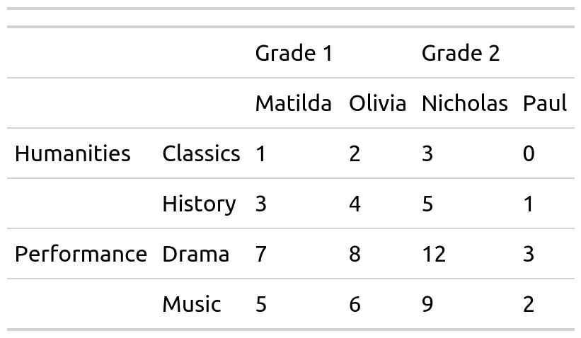
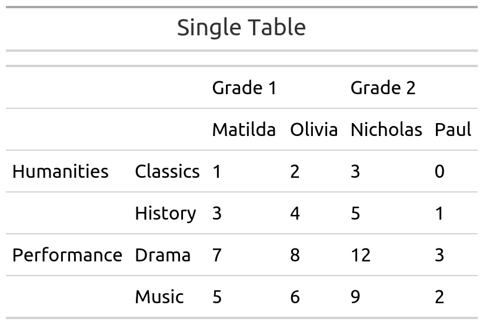
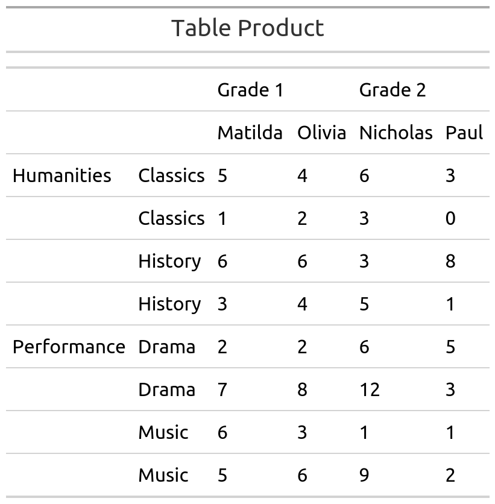

<!-- README.md is generated from README.Rmd. Please edit that file -->

```{r, include = FALSE}
knitr::opts_chunk$set(
  collapse = TRUE,
  comment = "#>",
  fig.path = "man/figures/README-",
  out.width = "100%"
)
```

# mmtable2

<!-- badges: start -->
<!-- badges: end -->

The goal of mmtable2 is to provide a ggplot2-like interface for untidy tables.
It does this by introducing algabraic untidy tables. 

## Installation

This probably to buggy for installation, but feel free to clone!

## Example

```{r example1, message=FALSE, warning=FALSE, include=FALSE}
# Load all packages
# rm(list = ls())
# devtools::build()
setwd("~/main/projects/mmtable2/")
library(tibble)
library("gtsummary")
library(gt)
library(tidyverse)
library(mmtable2)
# devtools::load_all()
# library(mmtable2)
# list.files("R",full.names = T) %>% map(source)
```

Here's a GIF demonstrating how to use mmtable2:

```{r echo=FALSE,  message=FALSE, warning=FALSE, out.width = "800px"}
knitr::include_graphics("https://unpivotr.s3.amazonaws.com/Peek+2021-04-11+15-34.gif")
```

```{r message=FALSE, warning=FALSE, include=FALSE}
# source("./methods/divide_mmtable.R")
# source("./methods/multiply_mmtable_.R")
# source("./methods/plus_mmtable_.R")
# source("./methods/print_mmtable.R")

source("https://raw.githubusercontent.com/ianmoran11/mmtable2/master/methods/divide_mmtable.R")
source("https://raw.githubusercontent.com/ianmoran11/mmtable2/master/methods/multiply_mmtable_.R")
source("https://raw.githubusercontent.com/ianmoran11/mmtable2/master/methods/plus_mmtable_.R")
source("https://raw.githubusercontent.com/ianmoran11/mmtable2/master/methods/print_mmtable.R")
```


```{r, message=FALSE, warning=FALSE, paged.print=FALSE}
student_df
```


```{r, message=FALSE, warning=FALSE, paged.print=FALSE}
table1 <-
  student_df %>%
  mmtable(table_data = value)  +
  header_top(student) +
  header_top_left(grade) +
  header_left(class) +
  header_left_top(subject)

try(table1 %>% gtsave("table1.png"))
```

```{r echo=FALSE,  message=FALSE, warning=FALSE, out.width = "800px"}

```


```{r, message=FALSE, warning=FALSE, paged.print=FALSE}
table1.1 <-
  student_df_1 %>%
  mmtable(table_data = value)  +
  header_top(student) +
  header_top_left(grade) +
  header_left(class) +
  header_left_top(subject)

try(table1.1 %>% gtsave("table1_1.png"))
```

```{r echo=FALSE,  message=FALSE, warning=FALSE, out.width = "800px"}
knitr::include_graphics("table1_1.png")
```

```{r, message=FALSE, warning=FALSE, paged.print=FALSE}
table2 <-
  student_df_2 %>%
  mmtable(table_data = value)  +
  header_top(student) +
  header_top_left(grade) +
  header_left(class) +
  header_left_top(subject)

try(table2 %>% gtsave("table2.png"))
```

```{r echo=FALSE,  message=FALSE, warning=FALSE, out.width = "800px"}
knitr::include_graphics("table2.png")
```

```{r, message=FALSE, warning=FALSE, paged.print=FALSE}
single_table <- table1 +  table_title("Single Table")  
try(single_table  %>% gtsave("single_table.png"))
```

```{r echo=FALSE,  message=FALSE, warning=FALSE, out.width = "800px"}

```


```{r, message=FALSE, warning=FALSE, paged.print=FALSE}
quotient_table <- table1 / table1.1  +  table_title("Table Quotient")
try(quotient_table  %>% gtsave("quotient_table.png"))
```

```{r echo=FALSE,  message=FALSE, warning=FALSE, out.width = "800px"}
knitr::include_graphics("quotient_table.png")
```


```{r, message=FALSE, warning=FALSE, paged.print=FALSE}
product_table <- table1 * table1.1  +  table_title("Table Product") 
try(product_table  %>% gtsave("product_table.png"))
```

```{r echo=FALSE,  message=FALSE, warning=FALSE, out.width = "800px"}

```


```{r, message=FALSE, warning=FALSE, paged.print=FALSE}
sum_table <- table1 + table2    +  table_title("Table Sum")     
try(sum_table  %>% gtsave("sum_table.png"))
```

```{r echo=FALSE,  message=FALSE, warning=FALSE, out.width = "800px"}
knitr::include_graphics("sum_table.png")
```


