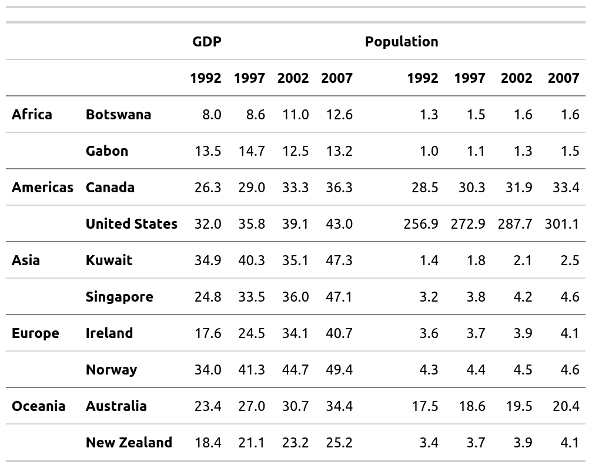
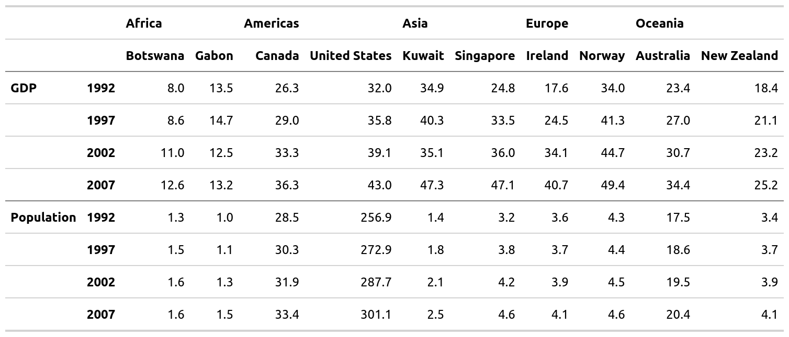
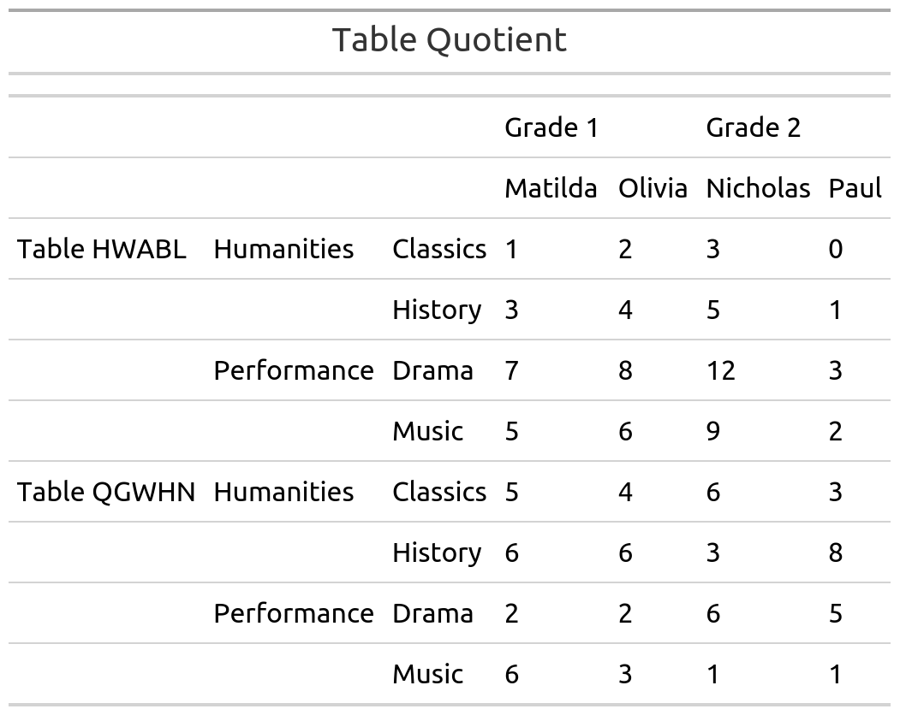
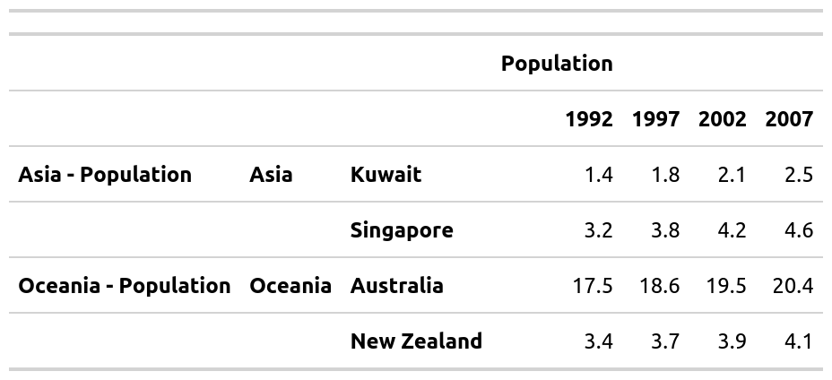
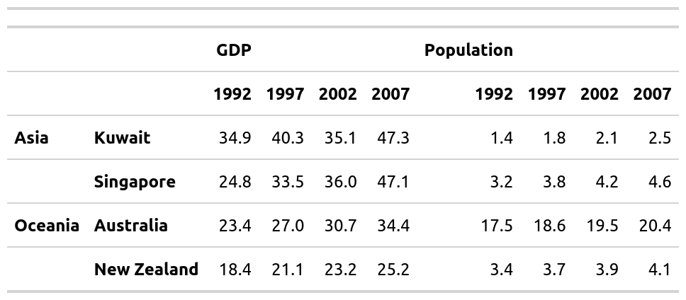
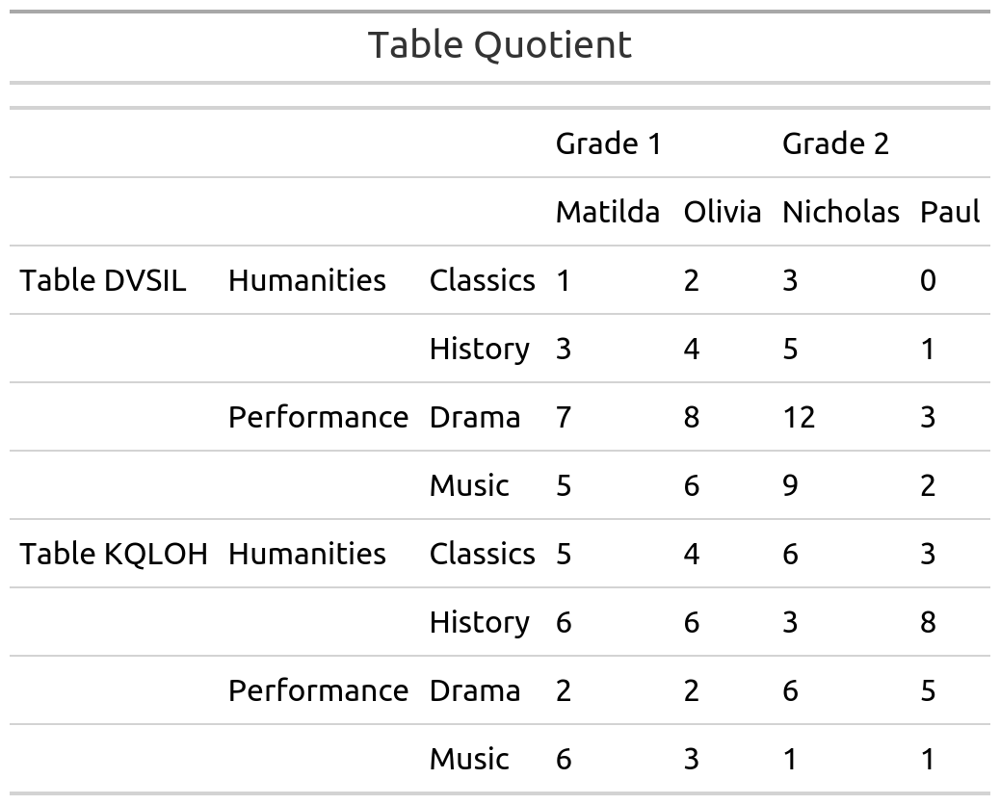

<!-- README.md is generated from README.Rmd. Please edit that file -->
mmtable2 <a> </a>
================================================================================

<!-- badges: start -->
[](https://travis-ci.org/ianmoran11/mmtable2) [](https://codecov.io/gh/ianmoran11/mmtable2?branch=master) <!-- badges: end -->

The goal of mmtable2 is to provide a ggplot2-like interface for untidy tables. It does this by introducing algabraic untidy tables.

Installation
------------

This package is probably too buggy for a smooth installation experience, but feel free to clone and tinker!

Example
-------

Here's a GIF demonstrating how to use mmtable2:


``` r

row_list <- cells_body(rows = c(1,3,5,7,9,11))
style_list <- list(cell_borders(sides = "top",color = "grey"))
gm_df <- gapminder_mm %>% filter(var != "Life expectancy")

gm_table <- 
 gm_df %>% 
  mmtable(table_data = value) +
  header_top(year) +
  header_left(country) +
  header_top_left(var)  +
  header_left_top(continent)  +
  table_format(
    locations = row_list,
    style = style_list)

try(apply_formats(gm_table) %>% gtsave("./man/figures/gm_table.png"))
#> TypeError: Attempting to change the setter of an unconfigurable property.
#> TypeError: Attempting to change the setter of an unconfigurable property.
```



Adding headers
--------------

You can add headers using data from a column in your data frame.

It's placement will depend on your your choice of header\_\* functions.

Header options include: top, top\_left, left, and left\_top.

``` r

row_list <- cells_body(rows = c(3,7))
col_list <- cells_body(columns = c(3,5,7,9,11))
style_list <- list(cell_borders(sides = "top",color = "grey"))
style_list2<- list(cell_borders(sides = "left",color = "grey"))
gm_df <- gapminder_mm %>% filter(var != "Life expectancy")
style_list3 = list(cell_text(align = "left"))

gm_table <- 
 gm_df %>% 
  mmtable(table_data = value) +
  header_left(year) +
  header_top(country) +
  header_left_top(var)  +
  header_top_left(continent)  +
  table_format(
    locations = row_list,
    style = style_list) +
  header_format(continent,style_list3 )

try(apply_formats(gm_table) %>% gtsave("./man/figures/gm_table.png"))
#> TypeError: Attempting to change the setter of an unconfigurable property.
#> TypeError: Attempting to change the setter of an unconfigurable property.
```



Combining tables
----------------

You can combine tables with `+`, `/` and `*` operators.

These are designed to be associative! For example, for the `+` operator, this implies (*t*1 + *t*2)+*t*3 = *t*1 + (*t*2 + *t*3).

This means you can compose tables easily.

``` r
ex1 <- t1 + t2
try(apply_formats(ex1) %>% gtsave("./man/figures/ex1.png"))
#> TypeError: Attempting to change the setter of an unconfigurable property.
#> TypeError: Attempting to change the setter of an unconfigurable property.
```



``` r

ex2 <- t1 / t4
try(apply_formats(ex2) %>% gtsave("./man/figures/ex2.png"))
#> TypeError: Attempting to change the setter of an unconfigurable property.
#> TypeError: Attempting to change the setter of an unconfigurable property.
```



``` r

ex3 <- t1 * t5 * t4 *  t2
try(apply_formats(ex3) %>% gtsave("./man/figures/ex3.png"))
#> TypeError: Attempting to change the setter of an unconfigurable property.
#> TypeError: Attempting to change the setter of an unconfigurable property.
```



Formatting tables
-----------------

mmtable2 outputs tables using the gt package's format.

This means you can alter formatting using many existing gt styling commands.

``` r

gm_table_formatted <- 
gapminder_mm %>% 
  filter(var != "Life expectancy") %>% 
  mmtable(table_data = value) +
  header_top(year) +
  header_left(country) +
  header_top_left(var)  +
  header_left_top(continent)  +
  cells_format(cell_predicate = T, style = list(cell_text(align = "right"))) +
  header_format(header = year, style = list(cell_text(align = "right"))) +
  header_format("all_cols", style = list(cell_text(weight = "bolder"))) +
  header_format("all_rows", style = list(cell_text(weight = "bolder"))) +
  table_format(
    locations = cells_body(rows = c(1,3,5,7,9,11)),
    style = list(cell_borders(sides = "top",color = "grey"))) + 
  table_source_note(source_note = "Excerpt of the Gapminder data on life expectancy, GDP per capita, and population by country." )


try(apply_formats(gm_table_formatted) %>% gtsave("./man/figures/gm_table_formatted.png"))
#> TypeError: Attempting to change the setter of an unconfigurable property.
#> TypeError: Attempting to change the setter of an unconfigurable property.
```

 \#\# Next steps

Features planned for the future include: \* merged column headers
\* an option top raise top left row headers.

The package is only a week old, so expect sharp edges!
