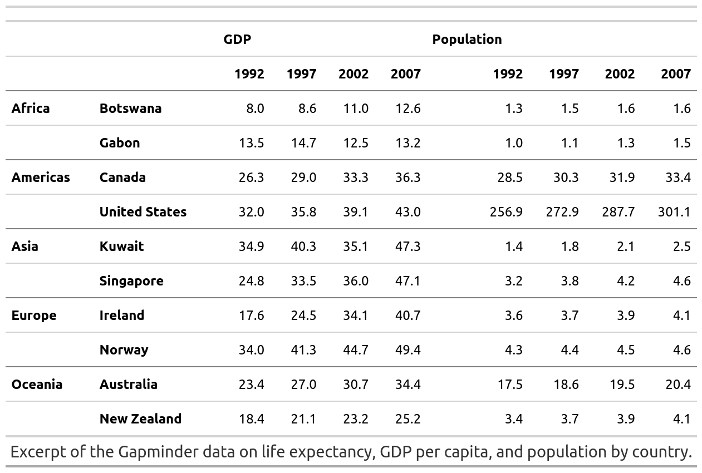
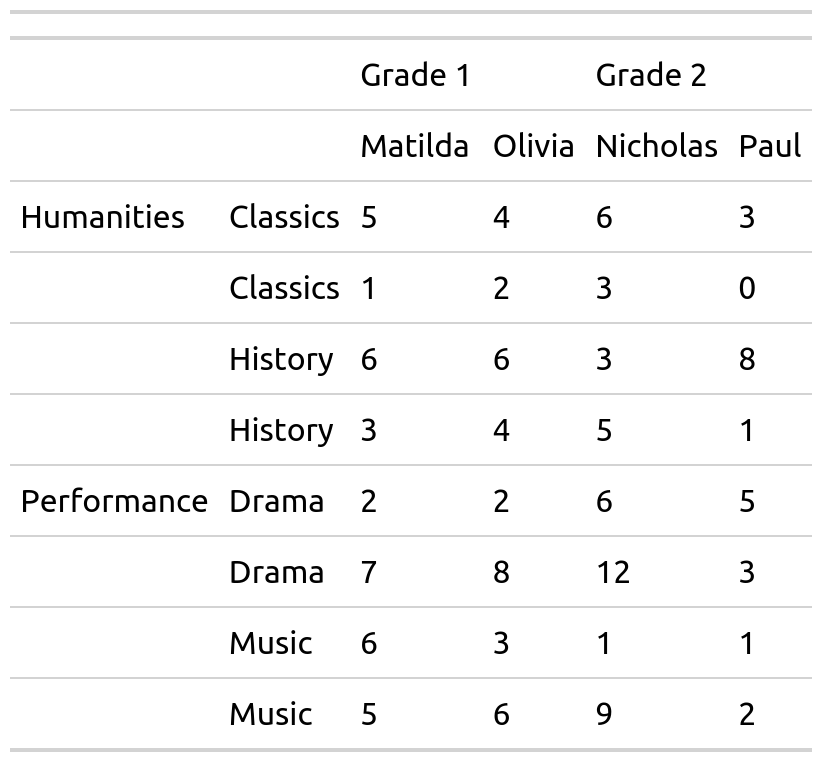
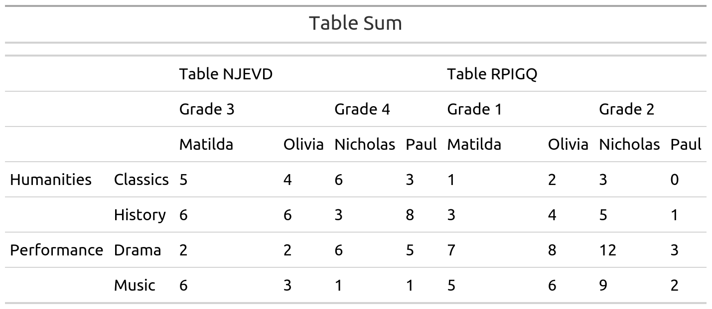
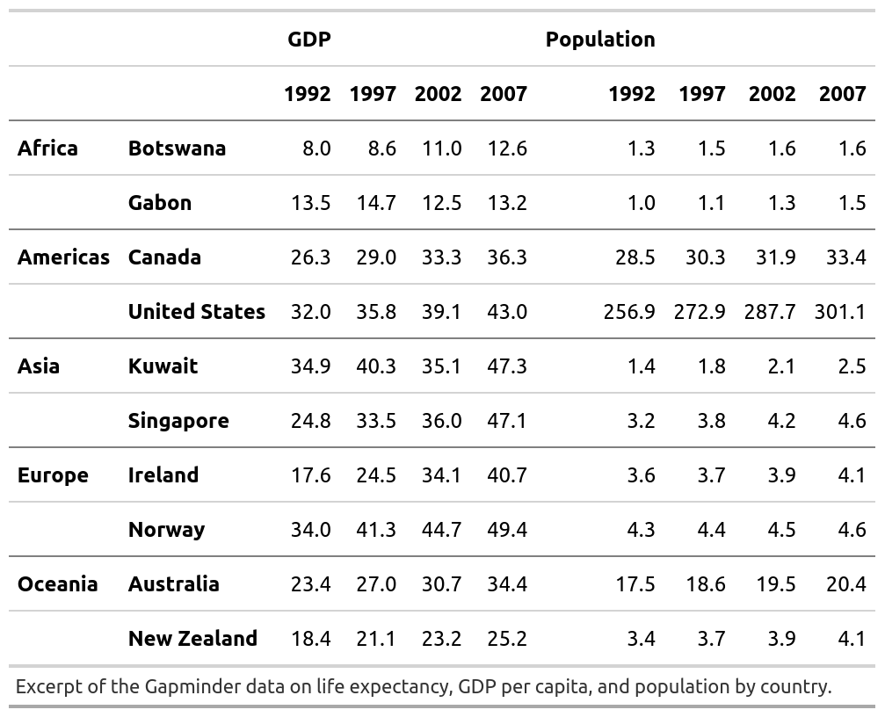
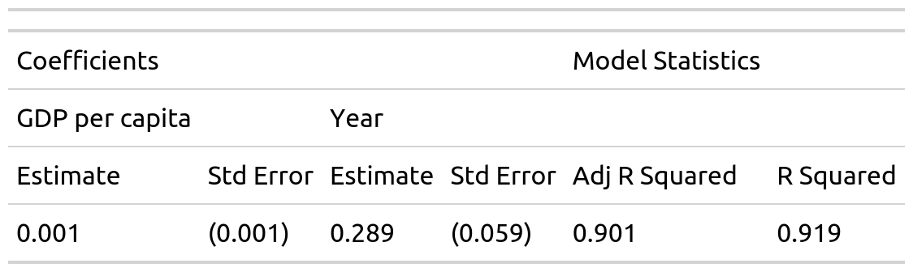
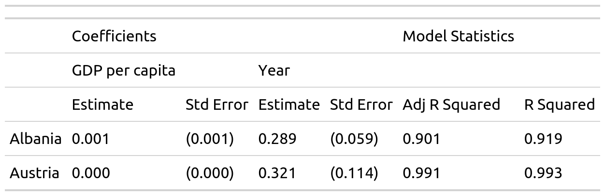

<!-- README.md is generated from README.Rmd. Please edit that file -->
mmtable2
========

<!-- badges: start -->
<!-- badges: end -->
The goal of mmtable2 is to provide a ggplot2-like interface for untidy tables. It does this by introducing algabraic untidy tables.

Installation
------------

This package is probably too buggy for a smooth installation experience, but feel free to clone and tinker!

Example
-------

Here's a couple of GIFs demonstrating how to use mmtable2:


``` r
student_df
#> # A tibble: 16 x 5
#>    subject     class    student  value grade  
#>    <chr>       <chr>    <chr>    <dbl> <chr>  
#>  1 Humanities  Classics Matilda      1 Grade 1
#>  2 Humanities  History  Matilda      3 Grade 1
#>  3 Performance Music    Matilda      5 Grade 1
#>  4 Performance Drama    Matilda      7 Grade 1
#>  5 Humanities  Classics Olivia       2 Grade 1
#>  6 Humanities  History  Olivia       4 Grade 1
#>  7 Performance Music    Olivia       6 Grade 1
#>  8 Performance Drama    Olivia       8 Grade 1
#>  9 Humanities  Classics Nicholas     3 Grade 2
#> 10 Humanities  History  Nicholas     5 Grade 2
#> 11 Performance Music    Nicholas     9 Grade 2
#> 12 Performance Drama    Nicholas    12 Grade 2
#> 13 Humanities  Classics Paul         0 Grade 2
#> 14 Humanities  History  Paul         1 Grade 2
#> 15 Performance Music    Paul         2 Grade 2
#> 16 Performance Drama    Paul         3 Grade 2
```

``` r
table1 <-
  student_df %>%
  mmtable(table_data = value)  +
  header_top(student) +
  header_top_left(grade) +
  header_left(class) +
  header_left_top(subject)

try(table1 %>% gtsave("table1.png"))
#> TypeError: Attempting to change the setter of an unconfigurable property.
#> TypeError: Attempting to change the setter of an unconfigurable property.
```



``` r
table1.1 <-
  student_df_1 %>%
  mmtable(table_data = value)  +
  header_top(student) +
  header_top_left(grade) +
  header_left(class) +
  header_left_top(subject)

table2 <-
  student_df_2 %>%
  mmtable(table_data = value)  +
  header_top(student) +
  header_top_left(grade) +
  header_left(class) +
  header_left_top(subject)
```

``` r
single_table <- table1 +  table_title("Single Table")  
try(single_table  %>% gtsave("single_table.png"))
#> TypeError: Attempting to change the setter of an unconfigurable property.
#> TypeError: Attempting to change the setter of an unconfigurable property.
```


``` r
quotient_table <- table1 / table1.1  +  table_title("Table Quotient")
try(quotient_table  %>% gtsave("quotient_table.png"))
#> TypeError: Attempting to change the setter of an unconfigurable property.
#> TypeError: Attempting to change the setter of an unconfigurable property.
```


``` r
product_table <- table1 * table1.1  +  table_title("Table Product") 
try(product_table  %>% gtsave("product_table.png"))
#> TypeError: Attempting to change the setter of an unconfigurable property.
#> TypeError: Attempting to change the setter of an unconfigurable property.
```



``` r
sum_table <- table1 + table2    +  table_title("Table Sum")     
try(sum_table  %>% gtsave("sum_table.png"))
#> TypeError: Attempting to change the setter of an unconfigurable property.
#> TypeError: Attempting to change the setter of an unconfigurable property.
```



``` r
gapminder_eur <-
  gapminder::gapminder %>%
  filter(continent == "Europe") %>%
  mutate(continent = continent %>% as.character())  %>%
  mutate(country = country %>% as.character())

model_df_list <- map(unique(gapminder_eur$country),possibly(model_lexp,NA), data =gapminder_eur )

model_df <- map(list("Australia"),model_lexp, data = gapminder) %>% .[[1]]
table_list <-  model_df_list[1:10] %>% map(table_model_wide)
```

``` r
demo_table <- 
model_df %>%
  mmtable(table_data = value,table_name = "Australia") +
  header_top(statistic) +
  header_top_left(term) +
  header_top_left(statistic_level)

try(demo_table  %>% gtsave("demo_table.png"))
#> TypeError: Attempting to change the setter of an unconfigurable property.
#> TypeError: Attempting to change the setter of an unconfigurable property.
```



``` r
one_table <-  table_list[[1]]
try(one_table  %>% gtsave("one_table.png"))
#> TypeError: Attempting to change the setter of an unconfigurable property.
#> TypeError: Attempting to change the setter of an unconfigurable property.
```



``` r
two_tables <- table_list[[1]] / table_list[[2]]
try(two_tables  %>% gtsave("two_tables.png"))
#> TypeError: Attempting to change the setter of an unconfigurable property.
#> TypeError: Attempting to change the setter of an unconfigurable property.
```



``` r
many_tables <- table_list %>% reduce(`/`)

table_list %>% reduce(`/`)
```

<!--html_preserve-->
<style>html {
  font-family: -apple-system, BlinkMacSystemFont, 'Segoe UI', Roboto, Oxygen, Ubuntu, Cantarell, 'Helvetica Neue', 'Fira Sans', 'Droid Sans', Arial, sans-serif;
}

#bwmrncuxkw .gt_table {
  display: table;
  border-collapse: collapse;
  margin-left: auto;
  margin-right: auto;
  color: #333333;
  font-size: 16px;
  font-weight: normal;
  font-style: normal;
  background-color: #FFFFFF;
  width: auto;
  border-top-style: solid;
  border-top-width: 2px;
  border-top-color: #A8A8A8;
  border-right-style: none;
  border-right-width: 2px;
  border-right-color: #D3D3D3;
  border-bottom-style: solid;
  border-bottom-width: 2px;
  border-bottom-color: #A8A8A8;
  border-left-style: none;
  border-left-width: 2px;
  border-left-color: #D3D3D3;
}

#bwmrncuxkw .gt_heading {
  background-color: #FFFFFF;
  text-align: center;
  border-bottom-color: #FFFFFF;
  border-left-style: none;
  border-left-width: 1px;
  border-left-color: #D3D3D3;
  border-right-style: none;
  border-right-width: 1px;
  border-right-color: #D3D3D3;
}

#bwmrncuxkw .gt_title {
  color: #333333;
  font-size: 125%;
  font-weight: initial;
  padding-top: 4px;
  padding-bottom: 4px;
  border-bottom-color: #FFFFFF;
  border-bottom-width: 0;
}

#bwmrncuxkw .gt_subtitle {
  color: #333333;
  font-size: 85%;
  font-weight: initial;
  padding-top: 0;
  padding-bottom: 4px;
  border-top-color: #FFFFFF;
  border-top-width: 0;
}

#bwmrncuxkw .gt_bottom_border {
  border-bottom-style: solid;
  border-bottom-width: 2px;
  border-bottom-color: #D3D3D3;
}

#bwmrncuxkw .gt_col_headings {
  border-top-style: solid;
  border-top-width: 2px;
  border-top-color: #D3D3D3;
  border-bottom-style: solid;
  border-bottom-width: 2px;
  border-bottom-color: #D3D3D3;
  border-left-style: none;
  border-left-width: 1px;
  border-left-color: #D3D3D3;
  border-right-style: none;
  border-right-width: 1px;
  border-right-color: #D3D3D3;
}

#bwmrncuxkw .gt_col_heading {
  color: #333333;
  background-color: #FFFFFF;
  font-size: 100%;
  font-weight: normal;
  text-transform: inherit;
  border-left-style: none;
  border-left-width: 1px;
  border-left-color: #D3D3D3;
  border-right-style: none;
  border-right-width: 1px;
  border-right-color: #D3D3D3;
  vertical-align: bottom;
  padding-top: 5px;
  padding-bottom: 6px;
  padding-left: 5px;
  padding-right: 5px;
  overflow-x: hidden;
}

#bwmrncuxkw .gt_column_spanner_outer {
  color: #333333;
  background-color: #FFFFFF;
  font-size: 100%;
  font-weight: normal;
  text-transform: inherit;
  padding-top: 0;
  padding-bottom: 0;
  padding-left: 4px;
  padding-right: 4px;
}

#bwmrncuxkw .gt_column_spanner_outer:first-child {
  padding-left: 0;
}

#bwmrncuxkw .gt_column_spanner_outer:last-child {
  padding-right: 0;
}

#bwmrncuxkw .gt_column_spanner {
  border-bottom-style: solid;
  border-bottom-width: 2px;
  border-bottom-color: #D3D3D3;
  vertical-align: bottom;
  padding-top: 5px;
  padding-bottom: 6px;
  overflow-x: hidden;
  display: inline-block;
  width: 100%;
}

#bwmrncuxkw .gt_group_heading {
  padding: 8px;
  color: #333333;
  background-color: #FFFFFF;
  font-size: 100%;
  font-weight: initial;
  text-transform: inherit;
  border-top-style: solid;
  border-top-width: 2px;
  border-top-color: #D3D3D3;
  border-bottom-style: solid;
  border-bottom-width: 2px;
  border-bottom-color: #D3D3D3;
  border-left-style: none;
  border-left-width: 1px;
  border-left-color: #D3D3D3;
  border-right-style: none;
  border-right-width: 1px;
  border-right-color: #D3D3D3;
  vertical-align: middle;
}

#bwmrncuxkw .gt_empty_group_heading {
  padding: 0.5px;
  color: #333333;
  background-color: #FFFFFF;
  font-size: 100%;
  font-weight: initial;
  border-top-style: solid;
  border-top-width: 2px;
  border-top-color: #D3D3D3;
  border-bottom-style: solid;
  border-bottom-width: 2px;
  border-bottom-color: #D3D3D3;
  vertical-align: middle;
}

#bwmrncuxkw .gt_from_md > :first-child {
  margin-top: 0;
}

#bwmrncuxkw .gt_from_md > :last-child {
  margin-bottom: 0;
}

#bwmrncuxkw .gt_row {
  padding-top: 8px;
  padding-bottom: 8px;
  padding-left: 5px;
  padding-right: 5px;
  margin: 10px;
  border-top-style: solid;
  border-top-width: 1px;
  border-top-color: #D3D3D3;
  border-left-style: none;
  border-left-width: 1px;
  border-left-color: #D3D3D3;
  border-right-style: none;
  border-right-width: 1px;
  border-right-color: #D3D3D3;
  vertical-align: middle;
  overflow-x: hidden;
}

#bwmrncuxkw .gt_stub {
  color: #333333;
  background-color: #FFFFFF;
  font-size: 100%;
  font-weight: initial;
  text-transform: inherit;
  border-right-style: solid;
  border-right-width: 2px;
  border-right-color: #D3D3D3;
  padding-left: 12px;
}

#bwmrncuxkw .gt_summary_row {
  color: #333333;
  background-color: #FFFFFF;
  text-transform: inherit;
  padding-top: 8px;
  padding-bottom: 8px;
  padding-left: 5px;
  padding-right: 5px;
}

#bwmrncuxkw .gt_first_summary_row {
  padding-top: 8px;
  padding-bottom: 8px;
  padding-left: 5px;
  padding-right: 5px;
  border-top-style: solid;
  border-top-width: 2px;
  border-top-color: #D3D3D3;
}

#bwmrncuxkw .gt_grand_summary_row {
  color: #333333;
  background-color: #FFFFFF;
  text-transform: inherit;
  padding-top: 8px;
  padding-bottom: 8px;
  padding-left: 5px;
  padding-right: 5px;
}

#bwmrncuxkw .gt_first_grand_summary_row {
  padding-top: 8px;
  padding-bottom: 8px;
  padding-left: 5px;
  padding-right: 5px;
  border-top-style: double;
  border-top-width: 6px;
  border-top-color: #D3D3D3;
}

#bwmrncuxkw .gt_striped {
  background-color: rgba(128, 128, 128, 0.05);
}

#bwmrncuxkw .gt_table_body {
  border-top-style: solid;
  border-top-width: 2px;
  border-top-color: #D3D3D3;
  border-bottom-style: solid;
  border-bottom-width: 2px;
  border-bottom-color: #D3D3D3;
}

#bwmrncuxkw .gt_footnotes {
  color: #333333;
  background-color: #FFFFFF;
  border-bottom-style: none;
  border-bottom-width: 2px;
  border-bottom-color: #D3D3D3;
  border-left-style: none;
  border-left-width: 2px;
  border-left-color: #D3D3D3;
  border-right-style: none;
  border-right-width: 2px;
  border-right-color: #D3D3D3;
}

#bwmrncuxkw .gt_footnote {
  margin: 0px;
  font-size: 90%;
  padding: 4px;
}

#bwmrncuxkw .gt_sourcenotes {
  color: #333333;
  background-color: #FFFFFF;
  border-bottom-style: none;
  border-bottom-width: 2px;
  border-bottom-color: #D3D3D3;
  border-left-style: none;
  border-left-width: 2px;
  border-left-color: #D3D3D3;
  border-right-style: none;
  border-right-width: 2px;
  border-right-color: #D3D3D3;
}

#bwmrncuxkw .gt_sourcenote {
  font-size: 90%;
  padding: 4px;
}

#bwmrncuxkw .gt_left {
  text-align: left;
}

#bwmrncuxkw .gt_center {
  text-align: center;
}

#bwmrncuxkw .gt_right {
  text-align: right;
  font-variant-numeric: tabular-nums;
}

#bwmrncuxkw .gt_font_normal {
  font-weight: normal;
}

#bwmrncuxkw .gt_font_bold {
  font-weight: bold;
}

#bwmrncuxkw .gt_font_italic {
  font-style: italic;
}

#bwmrncuxkw .gt_super {
  font-size: 65%;
}

#bwmrncuxkw .gt_footnote_marks {
  font-style: italic;
  font-size: 65%;
}
</style>
<table class="gt_table">
<thead class="gt_col_headings">
    <tr>
      <th class="gt_col_heading gt_columns_bottom_border gt_left" rowspan="1" colspan="1"> </th>
      <th class="gt_col_heading gt_columns_bottom_border gt_left" rowspan="1" colspan="1">  </th>
      <th class="gt_col_heading gt_columns_bottom_border gt_left" rowspan="1" colspan="1">   </th>
      <th class="gt_col_heading gt_columns_bottom_border gt_left" rowspan="1" colspan="1">    </th>
      <th class="gt_col_heading gt_columns_bottom_border gt_left" rowspan="1" colspan="1">     </th>
      <th class="gt_col_heading gt_columns_bottom_border gt_left" rowspan="1" colspan="1">      </th>
      <th class="gt_col_heading gt_columns_bottom_border gt_left" rowspan="1" colspan="1">       </th>
    </tr>

</thead>
<tbody class="gt_table_body">
    <tr>
      <td class="gt_row gt_left" style="background-color: #FFFFFF; color: #000000;"></td>
      <td class="gt_row gt_left" style="background-color: #FFFFFF; color: #000000;">Coefficients</td>
      <td class="gt_row gt_left" style="background-color: #FFFFFF; color: #000000;"> </td>
      <td class="gt_row gt_left" style="background-color: #FFFFFF; color: #000000;"> </td>
      <td class="gt_row gt_left" style="background-color: #FFFFFF; color: #000000;"> </td>
      <td class="gt_row gt_left" style="background-color: #FFFFFF; color: #000000;">Model Statistics</td>
      <td class="gt_row gt_left" style="background-color: #FFFFFF; color: #000000;"> </td>
    </tr>
    <tr>
      <td class="gt_row gt_left" style="background-color: #FFFFFF; color: #000000;"></td>
      <td class="gt_row gt_left" style="background-color: #FFFFFF; color: #000000;">GDP per capita</td>
      <td class="gt_row gt_left" style="background-color: #FFFFFF; color: #000000;"> </td>
      <td class="gt_row gt_left" style="background-color: #FFFFFF; color: #000000;">Year</td>
      <td class="gt_row gt_left" style="background-color: #FFFFFF; color: #000000;"> </td>
      <td class="gt_row gt_left" style="background-color: #FFFFFF; color: #000000;"> </td>
      <td class="gt_row gt_left" style="background-color: #FFFFFF; color: #000000;"> </td>
    </tr>
    <tr>
      <td class="gt_row gt_left" style="background-color: #FFFFFF; color: #000000;"></td>
      <td class="gt_row gt_left" style="background-color: #FFFFFF; color: #000000;">Estimate</td>
      <td class="gt_row gt_left" style="background-color: #FFFFFF; color: #000000;">Std Error</td>
      <td class="gt_row gt_left" style="background-color: #FFFFFF; color: #000000;">Estimate</td>
      <td class="gt_row gt_left" style="background-color: #FFFFFF; color: #000000;">Std Error</td>
      <td class="gt_row gt_left" style="background-color: #FFFFFF; color: #000000;">Adj R Squared</td>
      <td class="gt_row gt_left" style="background-color: #FFFFFF; color: #000000;">R Squared</td>
    </tr>
    <tr>
      <td class="gt_row gt_left" style="background-color: #FFFFFF; color: #000000;">Albania</td>
      <td class="gt_row gt_left" style="background-color: #FFFFFF; color: #000000;">0.001</td>
      <td class="gt_row gt_left" style="background-color: #FFFFFF; color: #000000;">(0.001)</td>
      <td class="gt_row gt_left" style="background-color: #FFFFFF; color: #000000;">0.289</td>
      <td class="gt_row gt_left" style="background-color: #FFFFFF; color: #000000;">(0.059)</td>
      <td class="gt_row gt_left" style="background-color: #FFFFFF; color: #000000;">0.901</td>
      <td class="gt_row gt_left" style="background-color: #FFFFFF; color: #000000;">0.919</td>
    </tr>
    <tr>
      <td class="gt_row gt_left" style="background-color: #FFFFFF; color: #000000;">Austria</td>
      <td class="gt_row gt_left" style="background-color: #FFFFFF; color: #000000;">0.000</td>
      <td class="gt_row gt_left" style="background-color: #FFFFFF; color: #000000;">(0.000)</td>
      <td class="gt_row gt_left" style="background-color: #FFFFFF; color: #000000;">0.321</td>
      <td class="gt_row gt_left" style="background-color: #FFFFFF; color: #000000;">(0.114)</td>
      <td class="gt_row gt_left" style="background-color: #FFFFFF; color: #000000;">0.991</td>
      <td class="gt_row gt_left" style="background-color: #FFFFFF; color: #000000;">0.993</td>
    </tr>
    <tr>
      <td class="gt_row gt_left" style="background-color: #FFFFFF; color: #000000;">Belgium</td>
      <td class="gt_row gt_left" style="background-color: #FFFFFF; color: #000000;">0.000</td>
      <td class="gt_row gt_left" style="background-color: #FFFFFF; color: #000000;">(0.000)</td>
      <td class="gt_row gt_left" style="background-color: #FFFFFF; color: #000000;">0.243</td>
      <td class="gt_row gt_left" style="background-color: #FFFFFF; color: #000000;">(0.061)</td>
      <td class="gt_row gt_left" style="background-color: #FFFFFF; color: #000000;">0.994</td>
      <td class="gt_row gt_left" style="background-color: #FFFFFF; color: #000000;">0.995</td>
    </tr>
    <tr>
      <td class="gt_row gt_left" style="background-color: #FFFFFF; color: #000000;">Bosnia and Herzegovina</td>
      <td class="gt_row gt_left" style="background-color: #FFFFFF; color: #000000;">0.000</td>
      <td class="gt_row gt_left" style="background-color: #FFFFFF; color: #000000;">(0.001)</td>
      <td class="gt_row gt_left" style="background-color: #FFFFFF; color: #000000;">0.387</td>
      <td class="gt_row gt_left" style="background-color: #FFFFFF; color: #000000;">(0.097)</td>
      <td class="gt_row gt_left" style="background-color: #FFFFFF; color: #000000;">0.875</td>
      <td class="gt_row gt_left" style="background-color: #FFFFFF; color: #000000;">0.898</td>
    </tr>
    <tr>
      <td class="gt_row gt_left" style="background-color: #FFFFFF; color: #000000;">Bulgaria</td>
      <td class="gt_row gt_left" style="background-color: #FFFFFF; color: #000000;">0.001</td>
      <td class="gt_row gt_left" style="background-color: #FFFFFF; color: #000000;">(0.001)</td>
      <td class="gt_row gt_left" style="background-color: #FFFFFF; color: #000000;">0.045</td>
      <td class="gt_row gt_left" style="background-color: #FFFFFF; color: #000000;">(0.067)</td>
      <td class="gt_row gt_left" style="background-color: #FFFFFF; color: #000000;">0.596</td>
      <td class="gt_row gt_left" style="background-color: #FFFFFF; color: #000000;">0.669</td>
    </tr>
    <tr>
      <td class="gt_row gt_left" style="background-color: #FFFFFF; color: #000000;">Croatia</td>
      <td class="gt_row gt_left" style="background-color: #FFFFFF; color: #000000;">0.000</td>
      <td class="gt_row gt_left" style="background-color: #FFFFFF; color: #000000;">(0.000)</td>
      <td class="gt_row gt_left" style="background-color: #FFFFFF; color: #000000;">0.199</td>
      <td class="gt_row gt_left" style="background-color: #FFFFFF; color: #000000;">(0.034)</td>
      <td class="gt_row gt_left" style="background-color: #FFFFFF; color: #000000;">0.925</td>
      <td class="gt_row gt_left" style="background-color: #FFFFFF; color: #000000;">0.939</td>
    </tr>
    <tr>
      <td class="gt_row gt_left" style="background-color: #FFFFFF; color: #000000;">Czech Republic</td>
      <td class="gt_row gt_left" style="background-color: #FFFFFF; color: #000000;">0.000</td>
      <td class="gt_row gt_left" style="background-color: #FFFFFF; color: #000000;">(0.000)</td>
      <td class="gt_row gt_left" style="background-color: #FFFFFF; color: #000000;">0.124</td>
      <td class="gt_row gt_left" style="background-color: #FFFFFF; color: #000000;">(0.042)</td>
      <td class="gt_row gt_left" style="background-color: #FFFFFF; color: #000000;">0.901</td>
      <td class="gt_row gt_left" style="background-color: #FFFFFF; color: #000000;">0.919</td>
    </tr>
    <tr>
      <td class="gt_row gt_left" style="background-color: #FFFFFF; color: #000000;">Denmark</td>
      <td class="gt_row gt_left" style="background-color: #FFFFFF; color: #000000;">0.000</td>
      <td class="gt_row gt_left" style="background-color: #FFFFFF; color: #000000;">(0.000)</td>
      <td class="gt_row gt_left" style="background-color: #FFFFFF; color: #000000;">0.019</td>
      <td class="gt_row gt_left" style="background-color: #FFFFFF; color: #000000;">(0.088)</td>
      <td class="gt_row gt_left" style="background-color: #FFFFFF; color: #000000;">0.969</td>
      <td class="gt_row gt_left" style="background-color: #FFFFFF; color: #000000;">0.974</td>
    </tr>
    <tr>
      <td class="gt_row gt_left" style="background-color: #FFFFFF; color: #000000;">Finland</td>
      <td class="gt_row gt_left" style="background-color: #FFFFFF; color: #000000;">0.000</td>
      <td class="gt_row gt_left" style="background-color: #FFFFFF; color: #000000;">(0.000)</td>
      <td class="gt_row gt_left" style="background-color: #FFFFFF; color: #000000;">0.237</td>
      <td class="gt_row gt_left" style="background-color: #FFFFFF; color: #000000;">(0.036)</td>
      <td class="gt_row gt_left" style="background-color: #FFFFFF; color: #000000;">0.992</td>
      <td class="gt_row gt_left" style="background-color: #FFFFFF; color: #000000;">0.994</td>
    </tr>
    <tr>
      <td class="gt_row gt_left" style="background-color: #FFFFFF; color: #000000;">France</td>
      <td class="gt_row gt_left" style="background-color: #FFFFFF; color: #000000;">0.000</td>
      <td class="gt_row gt_left" style="background-color: #FFFFFF; color: #000000;">(0.000)</td>
      <td class="gt_row gt_left" style="background-color: #FFFFFF; color: #000000;">0.315</td>
      <td class="gt_row gt_left" style="background-color: #FFFFFF; color: #000000;">(0.064)</td>
      <td class="gt_row gt_left" style="background-color: #FFFFFF; color: #000000;">0.997</td>
      <td class="gt_row gt_left" style="background-color: #FFFFFF; color: #000000;">0.998</td>
    </tr>

</tbody>
</table>

<!--/html_preserve-->
``` r

divided <- table_list[[1]] / table_list[[2]]

divided / table_list[[3]]
```

<!--html_preserve-->
<style>html {
  font-family: -apple-system, BlinkMacSystemFont, 'Segoe UI', Roboto, Oxygen, Ubuntu, Cantarell, 'Helvetica Neue', 'Fira Sans', 'Droid Sans', Arial, sans-serif;
}

#lybfnrelfx .gt_table {
  display: table;
  border-collapse: collapse;
  margin-left: auto;
  margin-right: auto;
  color: #333333;
  font-size: 16px;
  font-weight: normal;
  font-style: normal;
  background-color: #FFFFFF;
  width: auto;
  border-top-style: solid;
  border-top-width: 2px;
  border-top-color: #A8A8A8;
  border-right-style: none;
  border-right-width: 2px;
  border-right-color: #D3D3D3;
  border-bottom-style: solid;
  border-bottom-width: 2px;
  border-bottom-color: #A8A8A8;
  border-left-style: none;
  border-left-width: 2px;
  border-left-color: #D3D3D3;
}

#lybfnrelfx .gt_heading {
  background-color: #FFFFFF;
  text-align: center;
  border-bottom-color: #FFFFFF;
  border-left-style: none;
  border-left-width: 1px;
  border-left-color: #D3D3D3;
  border-right-style: none;
  border-right-width: 1px;
  border-right-color: #D3D3D3;
}

#lybfnrelfx .gt_title {
  color: #333333;
  font-size: 125%;
  font-weight: initial;
  padding-top: 4px;
  padding-bottom: 4px;
  border-bottom-color: #FFFFFF;
  border-bottom-width: 0;
}

#lybfnrelfx .gt_subtitle {
  color: #333333;
  font-size: 85%;
  font-weight: initial;
  padding-top: 0;
  padding-bottom: 4px;
  border-top-color: #FFFFFF;
  border-top-width: 0;
}

#lybfnrelfx .gt_bottom_border {
  border-bottom-style: solid;
  border-bottom-width: 2px;
  border-bottom-color: #D3D3D3;
}

#lybfnrelfx .gt_col_headings {
  border-top-style: solid;
  border-top-width: 2px;
  border-top-color: #D3D3D3;
  border-bottom-style: solid;
  border-bottom-width: 2px;
  border-bottom-color: #D3D3D3;
  border-left-style: none;
  border-left-width: 1px;
  border-left-color: #D3D3D3;
  border-right-style: none;
  border-right-width: 1px;
  border-right-color: #D3D3D3;
}

#lybfnrelfx .gt_col_heading {
  color: #333333;
  background-color: #FFFFFF;
  font-size: 100%;
  font-weight: normal;
  text-transform: inherit;
  border-left-style: none;
  border-left-width: 1px;
  border-left-color: #D3D3D3;
  border-right-style: none;
  border-right-width: 1px;
  border-right-color: #D3D3D3;
  vertical-align: bottom;
  padding-top: 5px;
  padding-bottom: 6px;
  padding-left: 5px;
  padding-right: 5px;
  overflow-x: hidden;
}

#lybfnrelfx .gt_column_spanner_outer {
  color: #333333;
  background-color: #FFFFFF;
  font-size: 100%;
  font-weight: normal;
  text-transform: inherit;
  padding-top: 0;
  padding-bottom: 0;
  padding-left: 4px;
  padding-right: 4px;
}

#lybfnrelfx .gt_column_spanner_outer:first-child {
  padding-left: 0;
}

#lybfnrelfx .gt_column_spanner_outer:last-child {
  padding-right: 0;
}

#lybfnrelfx .gt_column_spanner {
  border-bottom-style: solid;
  border-bottom-width: 2px;
  border-bottom-color: #D3D3D3;
  vertical-align: bottom;
  padding-top: 5px;
  padding-bottom: 6px;
  overflow-x: hidden;
  display: inline-block;
  width: 100%;
}

#lybfnrelfx .gt_group_heading {
  padding: 8px;
  color: #333333;
  background-color: #FFFFFF;
  font-size: 100%;
  font-weight: initial;
  text-transform: inherit;
  border-top-style: solid;
  border-top-width: 2px;
  border-top-color: #D3D3D3;
  border-bottom-style: solid;
  border-bottom-width: 2px;
  border-bottom-color: #D3D3D3;
  border-left-style: none;
  border-left-width: 1px;
  border-left-color: #D3D3D3;
  border-right-style: none;
  border-right-width: 1px;
  border-right-color: #D3D3D3;
  vertical-align: middle;
}

#lybfnrelfx .gt_empty_group_heading {
  padding: 0.5px;
  color: #333333;
  background-color: #FFFFFF;
  font-size: 100%;
  font-weight: initial;
  border-top-style: solid;
  border-top-width: 2px;
  border-top-color: #D3D3D3;
  border-bottom-style: solid;
  border-bottom-width: 2px;
  border-bottom-color: #D3D3D3;
  vertical-align: middle;
}

#lybfnrelfx .gt_from_md > :first-child {
  margin-top: 0;
}

#lybfnrelfx .gt_from_md > :last-child {
  margin-bottom: 0;
}

#lybfnrelfx .gt_row {
  padding-top: 8px;
  padding-bottom: 8px;
  padding-left: 5px;
  padding-right: 5px;
  margin: 10px;
  border-top-style: solid;
  border-top-width: 1px;
  border-top-color: #D3D3D3;
  border-left-style: none;
  border-left-width: 1px;
  border-left-color: #D3D3D3;
  border-right-style: none;
  border-right-width: 1px;
  border-right-color: #D3D3D3;
  vertical-align: middle;
  overflow-x: hidden;
}

#lybfnrelfx .gt_stub {
  color: #333333;
  background-color: #FFFFFF;
  font-size: 100%;
  font-weight: initial;
  text-transform: inherit;
  border-right-style: solid;
  border-right-width: 2px;
  border-right-color: #D3D3D3;
  padding-left: 12px;
}

#lybfnrelfx .gt_summary_row {
  color: #333333;
  background-color: #FFFFFF;
  text-transform: inherit;
  padding-top: 8px;
  padding-bottom: 8px;
  padding-left: 5px;
  padding-right: 5px;
}

#lybfnrelfx .gt_first_summary_row {
  padding-top: 8px;
  padding-bottom: 8px;
  padding-left: 5px;
  padding-right: 5px;
  border-top-style: solid;
  border-top-width: 2px;
  border-top-color: #D3D3D3;
}

#lybfnrelfx .gt_grand_summary_row {
  color: #333333;
  background-color: #FFFFFF;
  text-transform: inherit;
  padding-top: 8px;
  padding-bottom: 8px;
  padding-left: 5px;
  padding-right: 5px;
}

#lybfnrelfx .gt_first_grand_summary_row {
  padding-top: 8px;
  padding-bottom: 8px;
  padding-left: 5px;
  padding-right: 5px;
  border-top-style: double;
  border-top-width: 6px;
  border-top-color: #D3D3D3;
}

#lybfnrelfx .gt_striped {
  background-color: rgba(128, 128, 128, 0.05);
}

#lybfnrelfx .gt_table_body {
  border-top-style: solid;
  border-top-width: 2px;
  border-top-color: #D3D3D3;
  border-bottom-style: solid;
  border-bottom-width: 2px;
  border-bottom-color: #D3D3D3;
}

#lybfnrelfx .gt_footnotes {
  color: #333333;
  background-color: #FFFFFF;
  border-bottom-style: none;
  border-bottom-width: 2px;
  border-bottom-color: #D3D3D3;
  border-left-style: none;
  border-left-width: 2px;
  border-left-color: #D3D3D3;
  border-right-style: none;
  border-right-width: 2px;
  border-right-color: #D3D3D3;
}

#lybfnrelfx .gt_footnote {
  margin: 0px;
  font-size: 90%;
  padding: 4px;
}

#lybfnrelfx .gt_sourcenotes {
  color: #333333;
  background-color: #FFFFFF;
  border-bottom-style: none;
  border-bottom-width: 2px;
  border-bottom-color: #D3D3D3;
  border-left-style: none;
  border-left-width: 2px;
  border-left-color: #D3D3D3;
  border-right-style: none;
  border-right-width: 2px;
  border-right-color: #D3D3D3;
}

#lybfnrelfx .gt_sourcenote {
  font-size: 90%;
  padding: 4px;
}

#lybfnrelfx .gt_left {
  text-align: left;
}

#lybfnrelfx .gt_center {
  text-align: center;
}

#lybfnrelfx .gt_right {
  text-align: right;
  font-variant-numeric: tabular-nums;
}

#lybfnrelfx .gt_font_normal {
  font-weight: normal;
}

#lybfnrelfx .gt_font_bold {
  font-weight: bold;
}

#lybfnrelfx .gt_font_italic {
  font-style: italic;
}

#lybfnrelfx .gt_super {
  font-size: 65%;
}

#lybfnrelfx .gt_footnote_marks {
  font-style: italic;
  font-size: 65%;
}
</style>
<table class="gt_table">
<thead class="gt_col_headings">
    <tr>
      <th class="gt_col_heading gt_columns_bottom_border gt_left" rowspan="1" colspan="1"> </th>
      <th class="gt_col_heading gt_columns_bottom_border gt_left" rowspan="1" colspan="1">  </th>
      <th class="gt_col_heading gt_columns_bottom_border gt_left" rowspan="1" colspan="1">   </th>
      <th class="gt_col_heading gt_columns_bottom_border gt_left" rowspan="1" colspan="1">    </th>
      <th class="gt_col_heading gt_columns_bottom_border gt_left" rowspan="1" colspan="1">     </th>
      <th class="gt_col_heading gt_columns_bottom_border gt_left" rowspan="1" colspan="1">      </th>
      <th class="gt_col_heading gt_columns_bottom_border gt_left" rowspan="1" colspan="1">       </th>
    </tr>

</thead>
<tbody class="gt_table_body">
    <tr>
      <td class="gt_row gt_left" style="background-color: #FFFFFF; color: #000000;"></td>
      <td class="gt_row gt_left" style="background-color: #FFFFFF; color: #000000;">Coefficients</td>
      <td class="gt_row gt_left" style="background-color: #FFFFFF; color: #000000;"> </td>
      <td class="gt_row gt_left" style="background-color: #FFFFFF; color: #000000;"> </td>
      <td class="gt_row gt_left" style="background-color: #FFFFFF; color: #000000;"> </td>
      <td class="gt_row gt_left" style="background-color: #FFFFFF; color: #000000;">Model Statistics</td>
      <td class="gt_row gt_left" style="background-color: #FFFFFF; color: #000000;"> </td>
    </tr>
    <tr>
      <td class="gt_row gt_left" style="background-color: #FFFFFF; color: #000000;"></td>
      <td class="gt_row gt_left" style="background-color: #FFFFFF; color: #000000;">GDP per capita</td>
      <td class="gt_row gt_left" style="background-color: #FFFFFF; color: #000000;"> </td>
      <td class="gt_row gt_left" style="background-color: #FFFFFF; color: #000000;">Year</td>
      <td class="gt_row gt_left" style="background-color: #FFFFFF; color: #000000;"> </td>
      <td class="gt_row gt_left" style="background-color: #FFFFFF; color: #000000;"> </td>
      <td class="gt_row gt_left" style="background-color: #FFFFFF; color: #000000;"> </td>
    </tr>
    <tr>
      <td class="gt_row gt_left" style="background-color: #FFFFFF; color: #000000;"></td>
      <td class="gt_row gt_left" style="background-color: #FFFFFF; color: #000000;">Estimate</td>
      <td class="gt_row gt_left" style="background-color: #FFFFFF; color: #000000;">Std Error</td>
      <td class="gt_row gt_left" style="background-color: #FFFFFF; color: #000000;">Estimate</td>
      <td class="gt_row gt_left" style="background-color: #FFFFFF; color: #000000;">Std Error</td>
      <td class="gt_row gt_left" style="background-color: #FFFFFF; color: #000000;">Adj R Squared</td>
      <td class="gt_row gt_left" style="background-color: #FFFFFF; color: #000000;">R Squared</td>
    </tr>
    <tr>
      <td class="gt_row gt_left" style="background-color: #FFFFFF; color: #000000;">Albania</td>
      <td class="gt_row gt_left" style="background-color: #FFFFFF; color: #000000;">0.001</td>
      <td class="gt_row gt_left" style="background-color: #FFFFFF; color: #000000;">(0.001)</td>
      <td class="gt_row gt_left" style="background-color: #FFFFFF; color: #000000;">0.289</td>
      <td class="gt_row gt_left" style="background-color: #FFFFFF; color: #000000;">(0.059)</td>
      <td class="gt_row gt_left" style="background-color: #FFFFFF; color: #000000;">0.901</td>
      <td class="gt_row gt_left" style="background-color: #FFFFFF; color: #000000;">0.919</td>
    </tr>
    <tr>
      <td class="gt_row gt_left" style="background-color: #FFFFFF; color: #000000;">Austria</td>
      <td class="gt_row gt_left" style="background-color: #FFFFFF; color: #000000;">0.000</td>
      <td class="gt_row gt_left" style="background-color: #FFFFFF; color: #000000;">(0.000)</td>
      <td class="gt_row gt_left" style="background-color: #FFFFFF; color: #000000;">0.321</td>
      <td class="gt_row gt_left" style="background-color: #FFFFFF; color: #000000;">(0.114)</td>
      <td class="gt_row gt_left" style="background-color: #FFFFFF; color: #000000;">0.991</td>
      <td class="gt_row gt_left" style="background-color: #FFFFFF; color: #000000;">0.993</td>
    </tr>
    <tr>
      <td class="gt_row gt_left" style="background-color: #FFFFFF; color: #000000;">Belgium</td>
      <td class="gt_row gt_left" style="background-color: #FFFFFF; color: #000000;">0.000</td>
      <td class="gt_row gt_left" style="background-color: #FFFFFF; color: #000000;">(0.000)</td>
      <td class="gt_row gt_left" style="background-color: #FFFFFF; color: #000000;">0.243</td>
      <td class="gt_row gt_left" style="background-color: #FFFFFF; color: #000000;">(0.061)</td>
      <td class="gt_row gt_left" style="background-color: #FFFFFF; color: #000000;">0.994</td>
      <td class="gt_row gt_left" style="background-color: #FFFFFF; color: #000000;">0.995</td>
    </tr>

</tbody>
</table>

<!--/html_preserve-->
``` r

try(many_tables  %>% gtsave("many_tables.png"))
#> TypeError: Attempting to change the setter of an unconfigurable property.
#> TypeError: Attempting to change the setter of an unconfigurable property.
```


