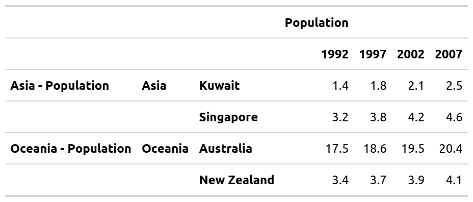
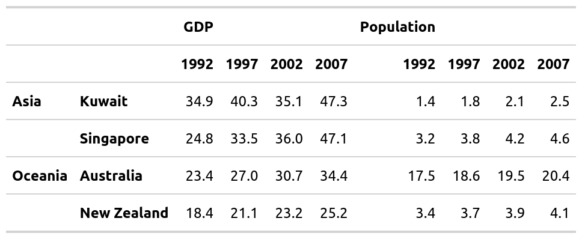
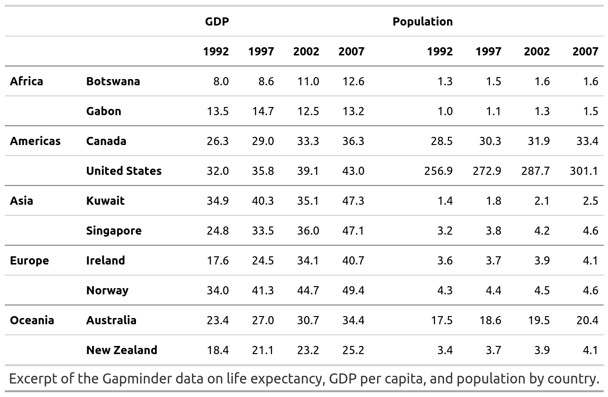

<!-- README.md is generated from README.Rmd. Please edit that file -->

# mmtable2 <a> </a>

<!-- badges: start -->

[](https://codecov.io/gh/ianmoran11/mmtable2?branch=master)
[](https://github.com/ianmoran11/mmtable2/actions)
[](https://lifecycle.r-lib.org/articles/stages.html#experimental)
<!-- badges: end -->

mmtable2 allows you to create and combine tables with a
ggplot2/patchwork syntax.

## Installation

mmtable2 is not available on CRAN. It can be installed from github with
the following script:

``` r
devtools::install_github("ianmoran11/mmtable2")
```

## Example

``` r
library(tidyverse)
library(gapminder)
library(webshot)
library(gt)
library(mmtable2)
```

Here’s a GIF demonstrating how to use mmtable2:


And here’s the code used in the GIF.

``` r
row_list <- cells_body(rows = c(1,3,5,7,9,11))
style_list <- list(cell_borders(sides = "top",color = "grey"))
gm_df <- gapminder_mm %>% filter(var != "Life expectancy")

gm_table <- 
 gm_df %>% 
  mmtable(table_data = value) +
  header_top(year) +
  header_left(country) +
  header_top_left(var)  +
  header_left_top(continent)  +
  table_format(
    locations = row_list,
    style = style_list)

gm_table
```


## Adding headers

You can add headers using data from a column in your data frame.

It’s placement will depend on your your choice of header\_\* functions.

Header options include: top, top\_left, left, and left\_top.

Here’s a table of the same data used above, this time with a different
header layout.

``` r
row_list <- cells_body(rows = c(3,7))
col_list <- cells_body(columns = c(3,5,7,9,11))
style_list <- list(cell_borders(sides = "top",color = "grey"))
style_list2<- list(cell_borders(sides = "left",color = "grey"))
gm_df <- gapminder_mm %>% filter(var != "Life expectancy")
style_list3 = list(cell_text(align = "left"))

gm_table <- 
 gm_df %>% 
  mmtable(table_data = value) +
  header_left(year) +
  header_top(country) +
  header_left_top(var)  +
  header_top_left(continent)  +
  table_format(
    locations = row_list,
    style = style_list) +
  header_format(continent,style_list3 )

gm_table
```


## Combining tables

You can combine tables with `+`, `/` and `*` operators.

These are designed to be associative! For example, for the `+` operator,
this implies (*t*1 + *t*2) + *t*3 = *t*1 + (*t*2 + *t*3).

This means you can compose tables easily.

Below are a few examples.

``` r
ex1 <- t1 + t2
ex1
```


``` r
ex2 <- t1 / t4
ex2
```



``` r
ex3 <- t1 * t5 * t4 *  t2
ex3
```



## Formatting tables

mmtable2 outputs tables using the gt package’s format.

This means you can alter formatting using many existing gt styling
commands.

``` r
gm_table_formatted <- 
gapminder_mm %>% 
  filter(var != "Life expectancy") %>% 
  mmtable(table_data = value) +
  header_top(year) +
  header_left(country) +
  header_top_left(var)  +
  header_left_top(continent)  +
  cells_format(cell_predicate = T, style = list(cell_text(align = "right"))) +
  header_format(header = year, style = list(cell_text(align = "right"))) +
  header_format("all_cols", style = list(cell_text(weight = "bolder"))) +
  header_format("all_rows", style = list(cell_text(weight = "bolder"))) +
  table_format(
    locations = cells_body(rows = c(1,3,5,7,9,11)),
    style = list(cell_borders(sides = "top",color = "grey"))) + 
  table_source_note(source_note = "Excerpt of the Gapminder data on life expectancy, GDP per capita, and population by country." )

gm_table_formatted
```


### Merged header columns

``` r
row_list <- cells_body(rows = c(3,7))
col_list <- cells_body(columns = c(3,5,7,9,11))
style_list <- list(cell_borders(sides = "top",color = "grey"))
style_list2<- list(cell_borders(sides = "left",color = "grey"))
gm_df <- gapminder_mm %>% filter(var != "Life expectancy")
style_list3 = list(cell_text(align = "left"))

gm_table_merged <- 
 gm_df %>% 
  mmtable(table_data = value) +
  header_left(year) +
  header_top(country) +
  header_left_top(var)  +
  header_top_left(continent)  +
  table_format(
    locations = row_list,
    style = style_list) +
  header_format(continent,style_list3 ) +
  header_merged_cols()

gm_table_merged
```


### Alternative pipe syntax (Experimental)

Adding the `add_` prefix to functions allows use of `%>%` in place of
`+`.

``` r
gm_table_piped <- 
gapminder_mm %>% 
  filter(var != "Life expectancy") %>% 
  mmtable(table_data = value, use_defaul_formats = T) %>% 
  add_header_top(year) %>% 
  add_header_left(country) %>% 
  add_header_top_left(var)  %>% 
  add_header_left_top(continent)  %>% 
  add_cells_format(cell_predicate = T, style = list(cell_text(align = "right"))) %>% 
  add_header_format(header = year, style = list(cell_text(align = "right"))) %>% 
  add_header_format("all_cols", style = list(cell_text(weight = "bolder"))) %>% 
  add_header_format("all_rows", style = list(cell_text(weight = "bolder"))) %>% 
  add_table_format(
    locations = cells_body(rows = c(1,3,5,7,9,11)),
    style = list(cell_borders(sides = "top",color = "grey"))) %>% 
  add_table_source_note(source_note = "Excerpt of the Gapminder data on life expectancy, GDP per capita, and population by country." )

gm_table_piped
```


