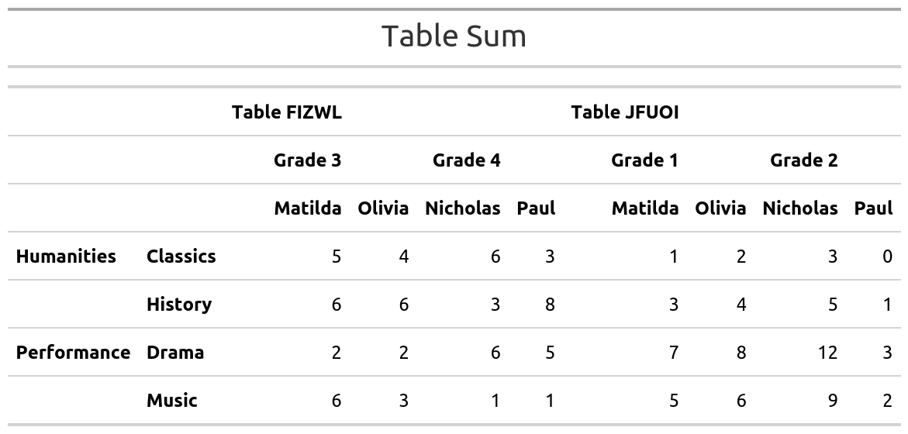

<!-- README.md is generated from README.Rmd. Please edit that file -->
mmtable2
========

<!-- badges: start -->
<!-- badges: end -->
The goal of mmtable2 is to provide a ggplot2-like interface for untidy tables. It does this by introducing algabraic untidy tables.

Installation
------------

This probably to buggy for installation, but feel free to clone!

Example
-------

Here's a GIF demonstrating how to use mmtable2:


``` r
student_df
#> # A tibble: 16 x 5
#>    subject     class    student  value grade  
#>    <chr>       <chr>    <chr>    <dbl> <chr>  
#>  1 Humanities  Classics Matilda      1 Grade 1
#>  2 Humanities  History  Matilda      3 Grade 1
#>  3 Performance Music    Matilda      5 Grade 1
#>  4 Performance Drama    Matilda      7 Grade 1
#>  5 Humanities  Classics Olivia       2 Grade 1
#>  6 Humanities  History  Olivia       4 Grade 1
#>  7 Performance Music    Olivia       6 Grade 1
#>  8 Performance Drama    Olivia       8 Grade 1
#>  9 Humanities  Classics Nicholas     3 Grade 2
#> 10 Humanities  History  Nicholas     5 Grade 2
#> 11 Performance Music    Nicholas     9 Grade 2
#> 12 Performance Drama    Nicholas    12 Grade 2
#> 13 Humanities  Classics Paul         0 Grade 2
#> 14 Humanities  History  Paul         1 Grade 2
#> 15 Performance Music    Paul         2 Grade 2
#> 16 Performance Drama    Paul         3 Grade 2
```

``` r
table1 <-
  student_df %>%
  mmtable(table_data = value)  +
  header_top(student) +
  header_top_left(grade) +
  header_left(class) +
  header_left_top(subject)

try(table1 %>% gtsave("table1.png"))
#> TypeError: Attempting to change the setter of an unconfigurable property.
#> TypeError: Attempting to change the setter of an unconfigurable property.
```


``` r
table1.1 <-
  student_df_1 %>%
  mmtable(table_data = value)  +
  header_top(student) +
  header_top_left(grade) +
  header_left(class) +
  header_left_top(subject)

try(table1.1 %>% gtsave("table1_1.png"))
#> TypeError: Attempting to change the setter of an unconfigurable property.
#> TypeError: Attempting to change the setter of an unconfigurable property.
```


``` r
table2 <-
  student_df_2 %>%
  mmtable(table_data = value)  +
  header_top(student) +
  header_top_left(grade) +
  header_left(class) +
  header_left_top(subject)

try(table2 %>% gtsave("table2.png"))
#> TypeError: Attempting to change the setter of an unconfigurable property.
#> TypeError: Attempting to change the setter of an unconfigurable property.
```


``` r
single_table <- table1 +  table_title("Single Table")  
try(single_table  %>% gtsave("single_table.png"))
#> TypeError: Attempting to change the setter of an unconfigurable property.
#> TypeError: Attempting to change the setter of an unconfigurable property.
```


``` r
quotient_table <- table1 / table1.1  +  table_title("Table Quotient")
try(quotient_table  %>% gtsave("quotient_table.png"))
#> TypeError: Attempting to change the setter of an unconfigurable property.
#> TypeError: Attempting to change the setter of an unconfigurable property.
```


``` r
product_table <- table1 * table1.1  +  table_title("Table Product") 
try(product_table  %>% gtsave("product_table.png"))
#> TypeError: Attempting to change the setter of an unconfigurable property.
#> TypeError: Attempting to change the setter of an unconfigurable property.
```



``` r
sum_table <- table1 + table2    +  table_title("Table Sum")     
try(sum_table  %>% gtsave("sum_table.png"))
#> TypeError: Attempting to change the setter of an unconfigurable property.
#> TypeError: Attempting to change the setter of an unconfigurable property.
```


