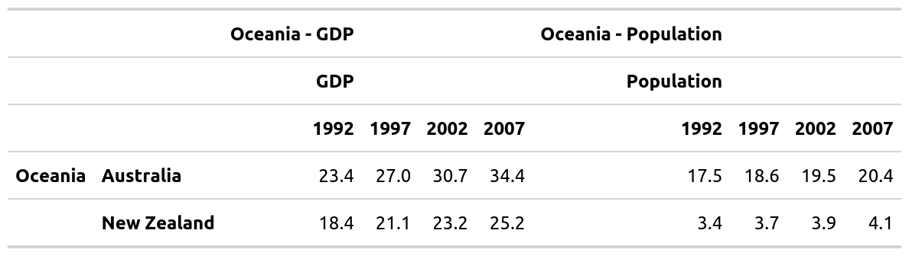

<!-- README.md is generated from README.Rmd. Please edit that file -->
mmtable2 <a> </a>
================================================================================

<!-- badges: start -->
[](https://travis-ci.org/ianmoran11/mmtable2) [](https://codecov.io/gh/ianmoran11/mmtable2?branch=master) <!-- badges: end -->

mmtable2 allows you to create and combine tables with a ggplot2/patchwork syntax.

Installation
------------

mmtable2 is not available on CRAN. It can be installed from github with the following script:

``` r
devtools::install_github("ianmoran11/mmtable2")
```

Example
-------

Here's a GIF demonstrating how to use mmtable2:


And here's the code used in the GIF.

``` r
row_list <- cells_body(rows = c(1,3,5,7,9,11))
style_list <- list(cell_borders(sides = "top",color = "grey"))
gm_df <- gapminder_mm %>% filter(var != "Life expectancy")

gm_table <- 
 gm_df %>% 
  mmtable(table_data = value) +
  header_top(year) +
  header_left(country) +
  header_top_left(var)  +
  header_left_top(continent)  +
  table_format(
    locations = row_list,
    style = style_list)

try(apply_formats(gm_table) %>% gtsave("./man/figures/gm_table.png"))
#> TypeError: Attempting to change the setter of an unconfigurable property.
#> TypeError: Attempting to change the setter of an unconfigurable property.
```


Adding headers
--------------

You can add headers using data from a column in your data frame.

It's placement will depend on your your choice of header\_\* functions.

Header options include: top, top\_left, left, and left\_top.

Here's a table of the same data used above, this time with a different header layout.

``` r
row_list <- cells_body(rows = c(3,7))
col_list <- cells_body(columns = c(3,5,7,9,11))
style_list <- list(cell_borders(sides = "top",color = "grey"))
style_list2<- list(cell_borders(sides = "left",color = "grey"))
gm_df <- gapminder_mm %>% filter(var != "Life expectancy")
style_list3 = list(cell_text(align = "left"))

gm_table <- 
 gm_df %>% 
  mmtable(table_data = value) +
  header_left(year) +
  header_top(country) +
  header_left_top(var)  +
  header_top_left(continent)  +
  table_format(
    locations = row_list,
    style = style_list) +
  header_format(continent,style_list3 )


try(apply_formats(gm_table) %>% gtsave("./man/figures/gm_table.png"))
#> TypeError: Attempting to change the setter of an unconfigurable property.
#> TypeError: Attempting to change the setter of an unconfigurable property.
```


Combining tables
----------------

You can combine tables with `+`, `/` and `*` operators.

These are designed to be associative! For example, for the `+` operator, this implies (*t*1 + *t*2)+*t*3 = *t*1 + (*t*2 + *t*3).

This means you can compose tables easily.

Below are a few examples.

``` r
ex1 <- t1 + t2
try(apply_formats(ex1) %>% gtsave("./man/figures/ex1.png"))
#> TypeError: Attempting to change the setter of an unconfigurable property.
#> TypeError: Attempting to change the setter of an unconfigurable property.
```



``` r
ex2 <- t1 / t4
try(apply_formats(ex2) %>% gtsave("./man/figures/ex2.png"))
#> TypeError: Attempting to change the setter of an unconfigurable property.
#> TypeError: Attempting to change the setter of an unconfigurable property.
```


``` r
ex3 <- t1 * t5 * t4 *  t2
try(apply_formats(ex3) %>% gtsave("./man/figures/ex3.png"))
#> TypeError: Attempting to change the setter of an unconfigurable property.
#> TypeError: Attempting to change the setter of an unconfigurable property.
```


Formatting tables
-----------------

mmtable2 outputs tables using the gt package's format.

This means you can alter formatting using many existing gt styling commands.

``` r
gm_table_formatted <- 
gapminder_mm %>% 
  filter(var != "Life expectancy") %>% 
  mmtable(table_data = value) +
  header_top(year) +
  header_left(country) +
  header_top_left(var)  +
  header_left_top(continent)  +
  cells_format(cell_predicate = T, style = list(cell_text(align = "right"))) +
  header_format(header = year, style = list(cell_text(align = "right"))) +
  header_format("all_cols", style = list(cell_text(weight = "bolder"))) +
  header_format("all_rows", style = list(cell_text(weight = "bolder"))) +
  table_format(
    locations = cells_body(rows = c(1,3,5,7,9,11)),
    style = list(cell_borders(sides = "top",color = "grey"))) + 
  table_source_note(source_note = "Excerpt of the Gapminder data on life expectancy, GDP per capita, and population by country." )
try(apply_formats(gm_table_formatted) %>% gtsave("./man/figures/gm_table_formatted.png"))
#> TypeError: Attempting to change the setter of an unconfigurable property.
#> TypeError: Attempting to change the setter of an unconfigurable property.
```


### Merged header columns

``` r
row_list <- cells_body(rows = c(3,7))
col_list <- cells_body(columns = c(3,5,7,9,11))
style_list <- list(cell_borders(sides = "top",color = "grey"))
style_list2<- list(cell_borders(sides = "left",color = "grey"))
gm_df <- gapminder_mm %>% filter(var != "Life expectancy")
style_list3 = list(cell_text(align = "left"))

gm_table <- 
 gm_df %>% 
  mmtable(table_data = value) +
  header_left(year) +
  header_top(country) +
  header_left_top(var)  +
  header_top_left(continent)  +
  table_format(
    locations = row_list,
    style = style_list) +
  header_format(continent,style_list3 ) +
  header_merged_cols()

apply_formats(gm_table)
```

<!--html_preserve-->
<!DOCTYPE html PUBLIC "-//W3C//DTD HTML 4.0 Transitional//EN" "http://www.w3.org/TR/REC-html40/loose.dtd">
<html>
<head>
<meta http-equiv="Content-Type" content="text/html; charset=UTF-8">
<style>html {
  font-family: -apple-system, BlinkMacSystemFont, 'Segoe UI', Roboto, Oxygen, Ubuntu, Cantarell, 'Helvetica Neue', 'Fira Sans', 'Droid Sans', Arial, sans-serif;
}

#orxmzgvhmp .gt_table {
  display: table;
  border-collapse: collapse;
  margin-left: auto;
  margin-right: auto;
  color: #333333;
  font-size: 16px;
  font-weight: normal;
  font-style: normal;
  background-color: #FFFFFF;
  width: auto;
  border-top-style: solid;
  border-top-width: 2px;
  border-top-color: #A8A8A8;
  border-right-style: none;
  border-right-width: 2px;
  border-right-color: #D3D3D3;
  border-bottom-style: solid;
  border-bottom-width: 2px;
  border-bottom-color: #A8A8A8;
  border-left-style: none;
  border-left-width: 2px;
  border-left-color: #D3D3D3;
}

#orxmzgvhmp .gt_heading {
  background-color: #FFFFFF;
  text-align: center;
  border-bottom-color: #FFFFFF;
  border-left-style: none;
  border-left-width: 1px;
  border-left-color: #D3D3D3;
  border-right-style: none;
  border-right-width: 1px;
  border-right-color: #D3D3D3;
}

#orxmzgvhmp .gt_title {
  color: #333333;
  font-size: 125%;
  font-weight: initial;
  padding-top: 4px;
  padding-bottom: 4px;
  border-bottom-color: #FFFFFF;
  border-bottom-width: 0;
}

#orxmzgvhmp .gt_subtitle {
  color: #333333;
  font-size: 85%;
  font-weight: initial;
  padding-top: 0;
  padding-bottom: 4px;
  border-top-color: #FFFFFF;
  border-top-width: 0;
}

#orxmzgvhmp .gt_bottom_border {
  border-bottom-style: solid;
  border-bottom-width: 2px;
  border-bottom-color: #D3D3D3;
}

#orxmzgvhmp .gt_col_headings {
  border-top-style: solid;
  border-top-width: 2px;
  border-top-color: #D3D3D3;
  border-bottom-style: solid;
  border-bottom-width: 2px;
  border-bottom-color: #D3D3D3;
  border-left-style: none;
  border-left-width: 1px;
  border-left-color: #D3D3D3;
  border-right-style: none;
  border-right-width: 1px;
  border-right-color: #D3D3D3;
}

#orxmzgvhmp .gt_col_heading {
  color: #333333;
  background-color: #FFFFFF;
  font-size: 100%;
  font-weight: normal;
  text-transform: inherit;
  border-left-style: none;
  border-left-width: 1px;
  border-left-color: #D3D3D3;
  border-right-style: none;
  border-right-width: 1px;
  border-right-color: #D3D3D3;
  vertical-align: bottom;
  padding-top: 5px;
  padding-bottom: 6px;
  padding-left: 5px;
  padding-right: 5px;
  overflow-x: hidden;
}

#orxmzgvhmp .gt_column_spanner_outer {
  color: #333333;
  background-color: #FFFFFF;
  font-size: 100%;
  font-weight: normal;
  text-transform: inherit;
  padding-top: 0;
  padding-bottom: 0;
  padding-left: 4px;
  padding-right: 4px;
}

#orxmzgvhmp .gt_column_spanner_outer:first-child {
  padding-left: 0;
}

#orxmzgvhmp .gt_column_spanner_outer:last-child {
  padding-right: 0;
}

#orxmzgvhmp .gt_column_spanner {
  border-bottom-style: solid;
  border-bottom-width: 2px;
  border-bottom-color: #D3D3D3;
  vertical-align: bottom;
  padding-top: 5px;
  padding-bottom: 6px;
  overflow-x: hidden;
  display: inline-block;
  width: 100%;
}

#orxmzgvhmp .gt_group_heading {
  padding: 8px;
  color: #333333;
  background-color: #FFFFFF;
  font-size: 100%;
  font-weight: initial;
  text-transform: inherit;
  border-top-style: solid;
  border-top-width: 2px;
  border-top-color: #D3D3D3;
  border-bottom-style: solid;
  border-bottom-width: 2px;
  border-bottom-color: #D3D3D3;
  border-left-style: none;
  border-left-width: 1px;
  border-left-color: #D3D3D3;
  border-right-style: none;
  border-right-width: 1px;
  border-right-color: #D3D3D3;
  vertical-align: middle;
}

#orxmzgvhmp .gt_empty_group_heading {
  padding: 0.5px;
  color: #333333;
  background-color: #FFFFFF;
  font-size: 100%;
  font-weight: initial;
  border-top-style: solid;
  border-top-width: 2px;
  border-top-color: #D3D3D3;
  border-bottom-style: solid;
  border-bottom-width: 2px;
  border-bottom-color: #D3D3D3;
  vertical-align: middle;
}

#orxmzgvhmp .gt_from_md > :first-child {
  margin-top: 0;
}

#orxmzgvhmp .gt_from_md > :last-child {
  margin-bottom: 0;
}

#orxmzgvhmp .gt_row {
  padding-top: 8px;
  padding-bottom: 8px;
  padding-left: 5px;
  padding-right: 5px;
  margin: 10px;
  border-top-style: solid;
  border-top-width: 1px;
  border-top-color: #D3D3D3;
  border-left-style: none;
  border-left-width: 1px;
  border-left-color: #D3D3D3;
  border-right-style: none;
  border-right-width: 1px;
  border-right-color: #D3D3D3;
  vertical-align: middle;
  overflow-x: hidden;
}

#orxmzgvhmp .gt_stub {
  color: #333333;
  background-color: #FFFFFF;
  font-size: 100%;
  font-weight: initial;
  text-transform: inherit;
  border-right-style: solid;
  border-right-width: 2px;
  border-right-color: #D3D3D3;
  padding-left: 12px;
}

#orxmzgvhmp .gt_summary_row {
  color: #333333;
  background-color: #FFFFFF;
  text-transform: inherit;
  padding-top: 8px;
  padding-bottom: 8px;
  padding-left: 5px;
  padding-right: 5px;
}

#orxmzgvhmp .gt_first_summary_row {
  padding-top: 8px;
  padding-bottom: 8px;
  padding-left: 5px;
  padding-right: 5px;
  border-top-style: solid;
  border-top-width: 2px;
  border-top-color: #D3D3D3;
}

#orxmzgvhmp .gt_grand_summary_row {
  color: #333333;
  background-color: #FFFFFF;
  text-transform: inherit;
  padding-top: 8px;
  padding-bottom: 8px;
  padding-left: 5px;
  padding-right: 5px;
}

#orxmzgvhmp .gt_first_grand_summary_row {
  padding-top: 8px;
  padding-bottom: 8px;
  padding-left: 5px;
  padding-right: 5px;
  border-top-style: double;
  border-top-width: 6px;
  border-top-color: #D3D3D3;
}

#orxmzgvhmp .gt_striped {
  background-color: rgba(128, 128, 128, 0.05);
}

#orxmzgvhmp .gt_table_body {
  border-top-style: solid;
  border-top-width: 2px;
  border-top-color: #D3D3D3;
  border-bottom-style: solid;
  border-bottom-width: 2px;
  border-bottom-color: #D3D3D3;
}

#orxmzgvhmp .gt_footnotes {
  color: #333333;
  background-color: #FFFFFF;
  border-bottom-style: none;
  border-bottom-width: 2px;
  border-bottom-color: #D3D3D3;
  border-left-style: none;
  border-left-width: 2px;
  border-left-color: #D3D3D3;
  border-right-style: none;
  border-right-width: 2px;
  border-right-color: #D3D3D3;
}

#orxmzgvhmp .gt_footnote {
  margin: 0px;
  font-size: 90%;
  padding: 4px;
}

#orxmzgvhmp .gt_sourcenotes {
  color: #333333;
  background-color: #FFFFFF;
  border-bottom-style: none;
  border-bottom-width: 2px;
  border-bottom-color: #D3D3D3;
  border-left-style: none;
  border-left-width: 2px;
  border-left-color: #D3D3D3;
  border-right-style: none;
  border-right-width: 2px;
  border-right-color: #D3D3D3;
}

#orxmzgvhmp .gt_sourcenote {
  font-size: 90%;
  padding: 4px;
}

#orxmzgvhmp .gt_left {
  text-align: left;
}

#orxmzgvhmp .gt_center {
  text-align: center;
}

#orxmzgvhmp .gt_right {
  text-align: right;
  font-variant-numeric: tabular-nums;
}

#orxmzgvhmp .gt_font_normal {
  font-weight: normal;
}

#orxmzgvhmp .gt_font_bold {
  font-weight: bold;
}

#orxmzgvhmp .gt_font_italic {
  font-style: italic;
}

#orxmzgvhmp .gt_super {
  font-size: 65%;
}

#orxmzgvhmp .gt_footnote_marks {
  font-style: italic;
  font-size: 65%;
}
</style>
</head>
<body>
<div id="orxmzgvhmp" style="overflow-x:auto;overflow-y:auto;width:auto;height:auto;">
<table class="gt_table">
<thead class="gt_col_headings">
<html>
<body>
<tr>
<th class="gt_center gt_columns_top_border gt_column_spanner_outer" rowspan="1" colspan="2" style="font-size: 12px; text-align: left; font-weight: bold;">
        <span class="gt_column_spanner">&nbsp;</span>
      </th>
      <th class="gt_center gt_columns_top_border gt_column_spanner_outer" rowspan="1" colspan="2" style="font-size: 12px; text-align: left; font-weight: bold;">
        <span class="gt_column_spanner">Africa</span>
      </th>
      <th class="gt_center gt_columns_top_border gt_column_spanner_outer" rowspan="1" colspan="2" style="font-size: 12px; text-align: left; font-weight: bold;">
        <span class="gt_column_spanner">Americas</span>
      </th>
      <th class="gt_center gt_columns_top_border gt_column_spanner_outer" rowspan="1" colspan="2" style="font-size: 12px; text-align: left; font-weight: bold;">
        <span class="gt_column_spanner">Asia</span>
      </th>
      <th class="gt_center gt_columns_top_border gt_column_spanner_outer" rowspan="1" colspan="2" style="font-size: 12px; text-align: left; font-weight: bold;">
        <span class="gt_column_spanner">Europe</span>
      </th>
      <th class="gt_center gt_columns_top_border gt_column_spanner_outer" rowspan="1" colspan="2" style="font-size: 12px; text-align: left; font-weight: bold;">
        <span class="gt_column_spanner">Oceania</span>
      </th>
    </tr></body></html>

<tr>
<th class="gt_col_heading gt_columns_bottom_border gt_left" rowspan="1" colspan="1" style="font-size: 12px; text-align: left; font-weight: bold;">
</th>
      <th class="gt_col_heading gt_columns_bottom_border gt_left" rowspan="1" colspan="1" style="font-size: 12px; text-align: left; font-weight: bold;"></th>
      <th class="gt_col_heading gt_columns_bottom_border gt_left" rowspan="1" colspan="1" style="font-size: 12px; text-align: left; font-weight: bold;">Botswana</th>
      <th class="gt_col_heading gt_columns_bottom_border gt_left" rowspan="1" colspan="1" style="font-size: 12px; text-align: left; font-weight: bold;">Gabon</th>
      <th class="gt_col_heading gt_columns_bottom_border gt_left" rowspan="1" colspan="1" style="font-size: 12px; text-align: left; font-weight: bold;">Canada</th>
      <th class="gt_col_heading gt_columns_bottom_border gt_left" rowspan="1" colspan="1" style="font-size: 12px; text-align: left; font-weight: bold;">United States</th>
      <th class="gt_col_heading gt_columns_bottom_border gt_left" rowspan="1" colspan="1" style="font-size: 12px; text-align: left; font-weight: bold;">Kuwait</th>
      <th class="gt_col_heading gt_columns_bottom_border gt_left" rowspan="1" colspan="1" style="font-size: 12px; text-align: left; font-weight: bold;">Singapore</th>
      <th class="gt_col_heading gt_columns_bottom_border gt_left" rowspan="1" colspan="1" style="font-size: 12px; text-align: left; font-weight: bold;">Ireland</th>
      <th class="gt_col_heading gt_columns_bottom_border gt_left" rowspan="1" colspan="1" style="font-size: 12px; text-align: left; font-weight: bold;">Norway</th>
      <th class="gt_col_heading gt_columns_bottom_border gt_left" rowspan="1" colspan="1" style="font-size: 12px; text-align: left; font-weight: bold;">Australia</th>
      <th class="gt_col_heading gt_columns_bottom_border gt_left" rowspan="1" colspan="1" style="font-size: 12px; text-align: left; font-weight: bold;">New Zealand</th>
    </tr>

</thead>
<tbody class="gt_table_body">
<tr>
<td class="gt_row gt_left" style="font-size: 12px; font-weight: bold;">
GDP
</td>
      <td class="gt_row gt_left" style="font-size: 12px; font-weight: bold;">1992</td>
      <td class="gt_row gt_left" style="font-size: 12px; text-align: right;">8.0</td>
      <td class="gt_row gt_left" style="font-size: 12px; text-align: right;">13.5</td>
      <td class="gt_row gt_left" style="font-size: 12px; text-align: right;">26.3</td>
      <td class="gt_row gt_left" style="font-size: 12px; text-align: right;">32.0</td>
      <td class="gt_row gt_left" style="font-size: 12px; text-align: right;">34.9</td>
      <td class="gt_row gt_left" style="font-size: 12px; text-align: right;">24.8</td>
      <td class="gt_row gt_left" style="font-size: 12px; text-align: right;">17.6</td>
      <td class="gt_row gt_left" style="font-size: 12px; text-align: right;">34.0</td>
      <td class="gt_row gt_left" style="font-size: 12px; text-align: right;">23.4</td>
      <td class="gt_row gt_left" style="font-size: 12px; text-align: right;">18.4</td>
    </tr>

<tr>
<td class="gt_row gt_left" style="font-size: 12px;">
</td>
      <td class="gt_row gt_left" style="font-size: 12px; font-weight: bold;">1997</td>
      <td class="gt_row gt_left" style="font-size: 12px; text-align: right;">8.6</td>
      <td class="gt_row gt_left" style="font-size: 12px; text-align: right;">14.7</td>
      <td class="gt_row gt_left" style="font-size: 12px; text-align: right;">29.0</td>
      <td class="gt_row gt_left" style="font-size: 12px; text-align: right;">35.8</td>
      <td class="gt_row gt_left" style="font-size: 12px; text-align: right;">40.3</td>
      <td class="gt_row gt_left" style="font-size: 12px; text-align: right;">33.5</td>
      <td class="gt_row gt_left" style="font-size: 12px; text-align: right;">24.5</td>
      <td class="gt_row gt_left" style="font-size: 12px; text-align: right;">41.3</td>
      <td class="gt_row gt_left" style="font-size: 12px; text-align: right;">27.0</td>
      <td class="gt_row gt_left" style="font-size: 12px; text-align: right;">21.1</td>
    </tr>

<tr>
<td class="gt_row gt_left" style="font-size: 12px; border-top-width: 1px; border-top-style: solid; border-top-color: grey;">
</td>
      <td class="gt_row gt_left" style="font-size: 12px; font-weight: bold; border-top-width: 1px; border-top-style: solid; border-top-color: grey;">2002</td>
      <td class="gt_row gt_left" style="font-size: 12px; text-align: right; border-top-width: 1px; border-top-style: solid; border-top-color: grey;">11.0</td>
      <td class="gt_row gt_left" style="font-size: 12px; text-align: right; border-top-width: 1px; border-top-style: solid; border-top-color: grey;">12.5</td>
      <td class="gt_row gt_left" style="font-size: 12px; text-align: right; border-top-width: 1px; border-top-style: solid; border-top-color: grey;">33.3</td>
      <td class="gt_row gt_left" style="font-size: 12px; text-align: right; border-top-width: 1px; border-top-style: solid; border-top-color: grey;">39.1</td>
      <td class="gt_row gt_left" style="font-size: 12px; text-align: right; border-top-width: 1px; border-top-style: solid; border-top-color: grey;">35.1</td>
      <td class="gt_row gt_left" style="font-size: 12px; text-align: right; border-top-width: 1px; border-top-style: solid; border-top-color: grey;">36.0</td>
      <td class="gt_row gt_left" style="font-size: 12px; text-align: right; border-top-width: 1px; border-top-style: solid; border-top-color: grey;">34.1</td>
      <td class="gt_row gt_left" style="font-size: 12px; text-align: right; border-top-width: 1px; border-top-style: solid; border-top-color: grey;">44.7</td>
      <td class="gt_row gt_left" style="font-size: 12px; text-align: right; border-top-width: 1px; border-top-style: solid; border-top-color: grey;">30.7</td>
      <td class="gt_row gt_left" style="font-size: 12px; text-align: right; border-top-width: 1px; border-top-style: solid; border-top-color: grey;">23.2</td>
    </tr>

<tr>
<td class="gt_row gt_left" style="font-size: 12px;">
</td>
      <td class="gt_row gt_left" style="font-size: 12px; font-weight: bold;">2007</td>
      <td class="gt_row gt_left" style="font-size: 12px; text-align: right;">12.6</td>
      <td class="gt_row gt_left" style="font-size: 12px; text-align: right;">13.2</td>
      <td class="gt_row gt_left" style="font-size: 12px; text-align: right;">36.3</td>
      <td class="gt_row gt_left" style="font-size: 12px; text-align: right;">43.0</td>
      <td class="gt_row gt_left" style="font-size: 12px; text-align: right;">47.3</td>
      <td class="gt_row gt_left" style="font-size: 12px; text-align: right;">47.1</td>
      <td class="gt_row gt_left" style="font-size: 12px; text-align: right;">40.7</td>
      <td class="gt_row gt_left" style="font-size: 12px; text-align: right;">49.4</td>
      <td class="gt_row gt_left" style="font-size: 12px; text-align: right;">34.4</td>
      <td class="gt_row gt_left" style="font-size: 12px; text-align: right;">25.2</td>
    </tr>

<tr>
<td class="gt_row gt_left" style="font-size: 12px; font-weight: bold;">
Population
</td>
      <td class="gt_row gt_left" style="font-size: 12px; font-weight: bold;">1992</td>
      <td class="gt_row gt_left" style="font-size: 12px; text-align: right;">1.3</td>
      <td class="gt_row gt_left" style="font-size: 12px; text-align: right;">1.0</td>
      <td class="gt_row gt_left" style="font-size: 12px; text-align: right;">28.5</td>
      <td class="gt_row gt_left" style="font-size: 12px; text-align: right;">256.9</td>
      <td class="gt_row gt_left" style="font-size: 12px; text-align: right;">1.4</td>
      <td class="gt_row gt_left" style="font-size: 12px; text-align: right;">3.2</td>
      <td class="gt_row gt_left" style="font-size: 12px; text-align: right;">3.6</td>
      <td class="gt_row gt_left" style="font-size: 12px; text-align: right;">4.3</td>
      <td class="gt_row gt_left" style="font-size: 12px; text-align: right;">17.5</td>
      <td class="gt_row gt_left" style="font-size: 12px; text-align: right;">3.4</td>
    </tr>

<tr>
<td class="gt_row gt_left" style="font-size: 12px;">
</td>
      <td class="gt_row gt_left" style="font-size: 12px; font-weight: bold;">1997</td>
      <td class="gt_row gt_left" style="font-size: 12px; text-align: right;">1.5</td>
      <td class="gt_row gt_left" style="font-size: 12px; text-align: right;">1.1</td>
      <td class="gt_row gt_left" style="font-size: 12px; text-align: right;">30.3</td>
      <td class="gt_row gt_left" style="font-size: 12px; text-align: right;">272.9</td>
      <td class="gt_row gt_left" style="font-size: 12px; text-align: right;">1.8</td>
      <td class="gt_row gt_left" style="font-size: 12px; text-align: right;">3.8</td>
      <td class="gt_row gt_left" style="font-size: 12px; text-align: right;">3.7</td>
      <td class="gt_row gt_left" style="font-size: 12px; text-align: right;">4.4</td>
      <td class="gt_row gt_left" style="font-size: 12px; text-align: right;">18.6</td>
      <td class="gt_row gt_left" style="font-size: 12px; text-align: right;">3.7</td>
    </tr>

<tr>
<td class="gt_row gt_left" style="font-size: 12px; border-top-width: 1px; border-top-style: solid; border-top-color: grey;">
</td>
      <td class="gt_row gt_left" style="font-size: 12px; font-weight: bold; border-top-width: 1px; border-top-style: solid; border-top-color: grey;">2002</td>
      <td class="gt_row gt_left" style="font-size: 12px; text-align: right; border-top-width: 1px; border-top-style: solid; border-top-color: grey;">1.6</td>
      <td class="gt_row gt_left" style="font-size: 12px; text-align: right; border-top-width: 1px; border-top-style: solid; border-top-color: grey;">1.3</td>
      <td class="gt_row gt_left" style="font-size: 12px; text-align: right; border-top-width: 1px; border-top-style: solid; border-top-color: grey;">31.9</td>
      <td class="gt_row gt_left" style="font-size: 12px; text-align: right; border-top-width: 1px; border-top-style: solid; border-top-color: grey;">287.7</td>
      <td class="gt_row gt_left" style="font-size: 12px; text-align: right; border-top-width: 1px; border-top-style: solid; border-top-color: grey;">2.1</td>
      <td class="gt_row gt_left" style="font-size: 12px; text-align: right; border-top-width: 1px; border-top-style: solid; border-top-color: grey;">4.2</td>
      <td class="gt_row gt_left" style="font-size: 12px; text-align: right; border-top-width: 1px; border-top-style: solid; border-top-color: grey;">3.9</td>
      <td class="gt_row gt_left" style="font-size: 12px; text-align: right; border-top-width: 1px; border-top-style: solid; border-top-color: grey;">4.5</td>
      <td class="gt_row gt_left" style="font-size: 12px; text-align: right; border-top-width: 1px; border-top-style: solid; border-top-color: grey;">19.5</td>
      <td class="gt_row gt_left" style="font-size: 12px; text-align: right; border-top-width: 1px; border-top-style: solid; border-top-color: grey;">3.9</td>
    </tr>

<tr>
<td class="gt_row gt_left" style="font-size: 12px;">
</td>
      <td class="gt_row gt_left" style="font-size: 12px; font-weight: bold;">2007</td>
      <td class="gt_row gt_left" style="font-size: 12px; text-align: right;">1.6</td>
      <td class="gt_row gt_left" style="font-size: 12px; text-align: right;">1.5</td>
      <td class="gt_row gt_left" style="font-size: 12px; text-align: right;">33.4</td>
      <td class="gt_row gt_left" style="font-size: 12px; text-align: right;">301.1</td>
      <td class="gt_row gt_left" style="font-size: 12px; text-align: right;">2.5</td>
      <td class="gt_row gt_left" style="font-size: 12px; text-align: right;">4.6</td>
      <td class="gt_row gt_left" style="font-size: 12px; text-align: right;">4.1</td>
      <td class="gt_row gt_left" style="font-size: 12px; text-align: right;">4.6</td>
      <td class="gt_row gt_left" style="font-size: 12px; text-align: right;">20.4</td>
      <td class="gt_row gt_left" style="font-size: 12px; text-align: right;">4.1</td>
    </tr>

</tbody>
</table>
</div>
</body>
</html>
<!--/html_preserve-->
.

Next steps
----------

Features planned for the future include:

-   merged column headers
-   an option top raise top left row headers.

The package is only a week old, so expect sharp edges!
