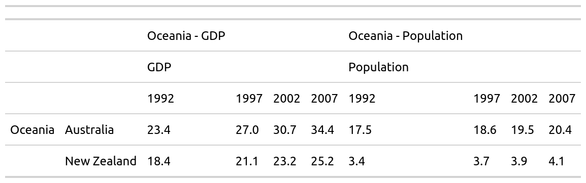

<!-- README.md is generated from README.Rmd. Please edit that file -->
mmtable2 <a> </a>
================================================================================

<!-- badges: start -->
[](https://travis-ci.org/ianmoran11/mmtable2) [](https://codecov.io/gh/ianmoran11/mmtable2?branch=master) <!-- badges: end -->

The goal of mmtable2 is to provide a ggplot2-like interface for untidy tables. It does this by introducing algabraic untidy tables.

Installation
------------

This package is probably too buggy for a smooth installation experience, but feel free to clone and tinker!

Example
-------

Here's a couple of GIFs demonstrating how to use mmtable2:


``` r
student_df
#> # A tibble: 16 x 5
#>    subject     class    student  value grade  
#>    <chr>       <chr>    <chr>    <dbl> <chr>  
#>  1 Humanities  Classics Matilda      1 Grade 1
#>  2 Humanities  History  Matilda      3 Grade 1
#>  3 Performance Music    Matilda      5 Grade 1
#>  4 Performance Drama    Matilda      7 Grade 1
#>  5 Humanities  Classics Olivia       2 Grade 1
#>  6 Humanities  History  Olivia       4 Grade 1
#>  7 Performance Music    Olivia       6 Grade 1
#>  8 Performance Drama    Olivia       8 Grade 1
#>  9 Humanities  Classics Nicholas     3 Grade 2
#> 10 Humanities  History  Nicholas     5 Grade 2
#> 11 Performance Music    Nicholas     9 Grade 2
#> 12 Performance Drama    Nicholas    12 Grade 2
#> 13 Humanities  Classics Paul         0 Grade 2
#> 14 Humanities  History  Paul         1 Grade 2
#> 15 Performance Music    Paul         2 Grade 2
#> 16 Performance Drama    Paul         3 Grade 2
```

``` r
table1 <-
  student_df %>%
  mmtable(table_data = value)  +
  header_top(student) +
  header_top_left(grade) +
  header_left(class) +
  header_left_top(subject)

try(apply_formats(table1) %>% gtsave("./man/figures/table1.png"))
#> TypeError: Attempting to change the setter of an unconfigurable property.
#> TypeError: Attempting to change the setter of an unconfigurable property.
```



``` r
table1.1 <-
  student_df_1 %>%
  mmtable(table_data = value)  +
  header_top(student) +
  header_top_left(grade) +
  header_left(class) +
  header_left_top(subject)

table2 <-
  student_df_2 %>%
  mmtable(table_data = value)  +
  header_top(student) +
  header_top_left(grade) +
  header_left(class) +
  header_left_top(subject)
```

``` r
single_table <- table1 +  table_title("Single Table")  
try(apply_formats(single_table)  %>% gtsave("./man/figures/single_table.png"))
#> TypeError: Attempting to change the setter of an unconfigurable property.
#> TypeError: Attempting to change the setter of an unconfigurable property.
```


``` r
quotient_table <- table1 / table1.1  +  table_title("Table Quotient")
try(apply_formats(quotient_table)  %>% gtsave("./man/figures/quotient_table.png"))
#> TypeError: Attempting to change the setter of an unconfigurable property.
#> TypeError: Attempting to change the setter of an unconfigurable property.
```


``` r
product_table <- table1 * table1.1  +  table_title("Table Product") 
try(apply_formats(product_table)  %>% gtsave("./man/figures/product_table.png"))
#> TypeError: Attempting to change the setter of an unconfigurable property.
#> TypeError: Attempting to change the setter of an unconfigurable property.
```


``` r
sum_table <- table1 + table2    +  table_title("Table Sum")     
try(apply_formats(sum_table)  %>% gtsave("./man/figures/sum_table.png"))
#> TypeError: Attempting to change the setter of an unconfigurable property.
#> TypeError: Attempting to change the setter of an unconfigurable property.
```


``` r
gapminder_eur <-
  gapminder::gapminder %>%
  filter(continent == "Europe") %>%
  mutate(continent = continent %>% as.character())  %>%
  mutate(country = country %>% as.character())

model_df_list <- map(unique(gapminder_eur$country),possibly(model_lexp,NA), data =gapminder_eur )

model_df <- map(list("Australia"),model_lexp, data = gapminder) %>% .[[1]]
table_list <-  model_df_list[1:10] %>% map(table_model_wide)
```

``` r
demo_table <- 
model_df %>%
  mmtable(table_data = value,table_name = "Australia") +
  header_top(statistic) +
  header_top_left(term) +
  header_top_left(statistic_level)

try(apply_formats(demo_table)  %>% gtsave("./man/figures/demo_table.png"))
#> Error : Problem with `mutate()` input `listed`.
#> x `.x` must be a vector, not a function
#> ℹ Input `listed` is `map2(col, row, ~list(row = .x, col = .y))`.
```

``` r
one_table <-  table_list[[1]]
try(apply_formats(one_table)  %>% gtsave("./man/figures/one_table.png"))
#> Error : Problem with `mutate()` input `listed`.
#> x `.x` must be a vector, not a function
#> ℹ Input `listed` is `map2(col, row, ~list(row = .x, col = .y))`.
```

``` r
two_tables <- table_list[[1]] / table_list[[2]]
try(apply_formats(two_tables)  %>% gtsave("./man/figures/two_tables.png"))
#> TypeError: Attempting to change the setter of an unconfigurable property.
#> TypeError: Attempting to change the setter of an unconfigurable property.
```


``` r
many_tables <- table_list %>% reduce(`/`)
try(apply_formats(many_tables)  %>% gtsave("./man/figures/many_tables.png"))
#> TypeError: Attempting to change the setter of an unconfigurable property.
#> TypeError: Attempting to change the setter of an unconfigurable property.
```


``` r

gm_table <- 
gapminder_mm %>% 
  filter(var != "Life expectancy") %>% 
  mmtable(table_data = value) +
  header_top(year) +
  header_left(country) +
  header_top_left(var)  +
  header_left_top(continent)  +
  cells_format(cell_predicate = T, style = list(cell_text(align = "right"))) +
  header_format(header = year, style = list(cell_text(align = "right"))) +
  header_format(var, style = list(cell_text(weight = "bolder"))) +
  header_format(country, style = list(cell_text(weight = "bolder"))) +
  header_format(continent, style = list(cell_text(weight = "bolder"))) +
  header_format(continent, style = list(cell_borders(sides = "top",color = "grey"))) +
  header_format(year, style = list(cell_text(weight = "bolder"))) +
  header_format(year, style = list(cell_borders(sides = "bottom",color = "grey"))) +
  table_format(
    locations = cells_body(rows = c(1,3,5,7,9,11)),
    style = list(cell_borders(sides = "top",color = "grey"))) +
  table_format(
    locations = cells_body(rows = c(1:12), columns = (1:10)),
    style = list(cell_text(size = px(12),  font = google_font("EB Garamond"))))


try(apply_formats(gm_table) %>% gtsave("./man/figures/gm_table.png"))
#> TypeError: Attempting to change the setter of an unconfigurable property.
#> TypeError: Attempting to change the setter of an unconfigurable property.
```


