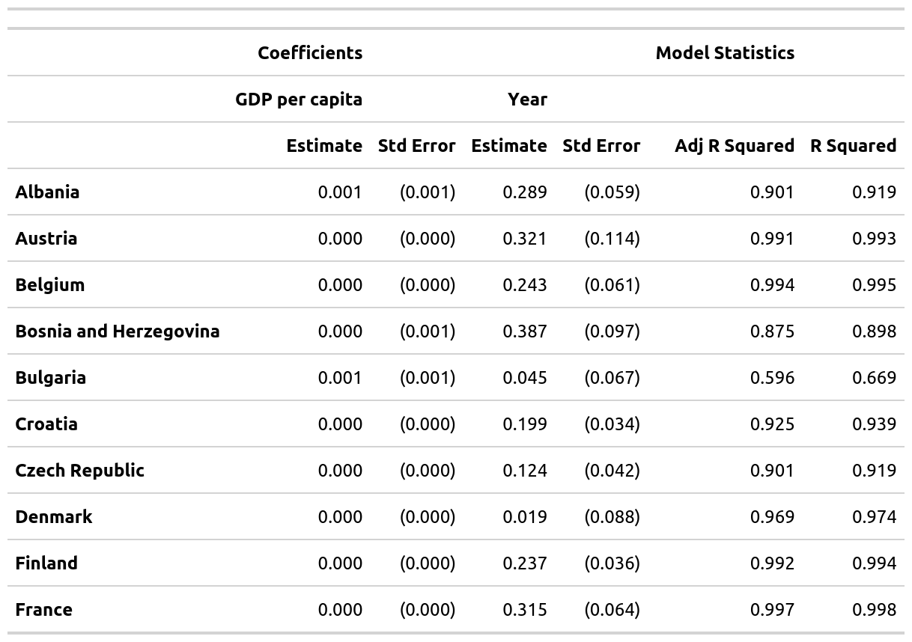

<!-- README.md is generated from README.Rmd. Please edit that file -->
mmtable2
========

<!-- badges: start -->
<!-- badges: end -->
The goal of mmtable2 is to provide a ggplot2-like interface for untidy tables. It does this by introducing algabraic untidy tables.

Installation
------------

This package is probably too buggy for a smooth installation experience, but feel free to clone and tinker!

Example
-------

Here's a couple of GIFs demonstrating how to use mmtable2:


``` r
student_df
#> # A tibble: 16 x 5
#>    subject     class    student  value grade  
#>    <chr>       <chr>    <chr>    <dbl> <chr>  
#>  1 Humanities  Classics Matilda      1 Grade 1
#>  2 Humanities  History  Matilda      3 Grade 1
#>  3 Performance Music    Matilda      5 Grade 1
#>  4 Performance Drama    Matilda      7 Grade 1
#>  5 Humanities  Classics Olivia       2 Grade 1
#>  6 Humanities  History  Olivia       4 Grade 1
#>  7 Performance Music    Olivia       6 Grade 1
#>  8 Performance Drama    Olivia       8 Grade 1
#>  9 Humanities  Classics Nicholas     3 Grade 2
#> 10 Humanities  History  Nicholas     5 Grade 2
#> 11 Performance Music    Nicholas     9 Grade 2
#> 12 Performance Drama    Nicholas    12 Grade 2
#> 13 Humanities  Classics Paul         0 Grade 2
#> 14 Humanities  History  Paul         1 Grade 2
#> 15 Performance Music    Paul         2 Grade 2
#> 16 Performance Drama    Paul         3 Grade 2
```

``` r
table1 <-
  student_df %>%
  mmtable(table_data = value)  +
  header_top(student) +
  header_top_left(grade) +
  header_left(class) +
  header_left_top(subject)

try(table1 %>% gtsave("table1.png"))
#> TypeError: Attempting to change the setter of an unconfigurable property.
#> TypeError: Attempting to change the setter of an unconfigurable property.
```


``` r
table1.1 <-
  student_df_1 %>%
  mmtable(table_data = value)  +
  header_top(student) +
  header_top_left(grade) +
  header_left(class) +
  header_left_top(subject)

table2 <-
  student_df_2 %>%
  mmtable(table_data = value)  +
  header_top(student) +
  header_top_left(grade) +
  header_left(class) +
  header_left_top(subject)
```

``` r
single_table <- table1 +  table_title("Single Table")  
try(single_table  %>% gtsave("single_table.png"))
#> TypeError: Attempting to change the setter of an unconfigurable property.
#> TypeError: Attempting to change the setter of an unconfigurable property.
```


``` r
quotient_table <- table1 / table1.1  +  table_title("Table Quotient")
try(quotient_table  %>% gtsave("quotient_table.png"))
#> TypeError: Attempting to change the setter of an unconfigurable property.
#> TypeError: Attempting to change the setter of an unconfigurable property.
```


``` r
product_table <- table1 * table1.1  +  table_title("Table Product") 
try(product_table  %>% gtsave("product_table.png"))
#> TypeError: Attempting to change the setter of an unconfigurable property.
#> TypeError: Attempting to change the setter of an unconfigurable property.
```


``` r
sum_table <- table1 + table2    +  table_title("Table Sum")     
try(sum_table  %>% gtsave("sum_table.png"))
#> TypeError: Attempting to change the setter of an unconfigurable property.
#> TypeError: Attempting to change the setter of an unconfigurable property.
```


``` r
gapminder_eur <-
  gapminder::gapminder %>%
  filter(continent == "Europe") %>%
  mutate(continent = continent %>% as.character())  %>%
  mutate(country = country %>% as.character())

model_df_list <- map(unique(gapminder_eur$country),possibly(model_lexp,NA), data =gapminder_eur )

model_df <- map(list("Australia"),model_lexp, data = gapminder) %>% .[[1]]
table_list <-  model_df_list[1:10] %>% map(table_model_wide)
```

``` r
demo_table <- 
model_df %>%
  mmtable(table_data = value,table_name = "Australia") +
  header_top(statistic) +
  header_top_left(term) +
  header_top_left(statistic_level)

try(demo_table  %>% gtsave("demo_table.png"))
#> TypeError: Attempting to change the setter of an unconfigurable property.
#> TypeError: Attempting to change the setter of an unconfigurable property.
```


``` r
one_table <-  table_list[[1]]
try(one_table  %>% gtsave("one_table.png"))
#> TypeError: Attempting to change the setter of an unconfigurable property.
#> TypeError: Attempting to change the setter of an unconfigurable property.
```


``` r
two_tables <- table_list[[1]] / table_list[[2]]
try(two_tables  %>% gtsave("two_tables.png"))
#> TypeError: Attempting to change the setter of an unconfigurable property.
#> TypeError: Attempting to change the setter of an unconfigurable property.
```



``` r
many_tables <- table_list %>% reduce(`/`)
try(many_tables  %>% gtsave("many_tables.png"))
#> TypeError: Attempting to change the setter of an unconfigurable property.
#> TypeError: Attempting to change the setter of an unconfigurable property.
```


``` r

table <-
gapminder_mm %>% 
  filter(var != "Life expectancy") %>% 
  mmtable(table_data = value) +
  header_top(year) +
  header_left(country) +
  header_top_left(var)  +
  header_left_top(continent)  +
  cells_format(cell_predicate = T, style = list(cell_text(align = "right"))) +
  header_format(header = year, style = list(cell_text(align = "right"))) +
  header_format(var, style = list(cell_text(weight = "bolder"))) +
  header_format(country, style = list(cell_text(weight = "bolder"))) +
  header_format(continent, style = list(cell_text(weight = "bolder"))) +
  header_format(continent, style = list(cell_borders(sides = "top",color = "grey"))) +
  header_format(year, style = list(cell_text(weight = "bolder"))) +
  header_format(year, style = list(cell_borders(sides = "bottom",color = "grey"))) +
  table_format(
    locations = cells_body(rows = c(1,3,5,7,9,11)),
    style = list(cell_borders(sides = "top",color = "grey"))) +
  table_format(
    locations = cells_body(rows = c(1:12), columns = (1:10)),
    style = list(cell_text(size = px(12),  font = google_font("EB Garamond"))))
#> List of 1
#>  $ format_YNZIL:List of 3
#>   ..$ cell_predicate:List of 1
#>   .. ..$ : language ~T
#>   .. .. ..- attr(*, ".Environment")=<environment: R_GlobalEnv> 
#>   .. ..- attr(*, "class")= chr [1:2] "quosures" "list"
#>   ..$ func          : chr "cells_format"
#>   ..$ format_list   :List of 1
#>   .. ..$ style:List of 1
#>   .. .. ..$ :List of 1
#>   .. .. .. ..$ cell_text:List of 1
#>   .. .. .. .. ..$ align: chr "right"
#>   .. .. .. .. ..- attr(*, "class")= chr [1:2] "cell_text" "cell_style"
#>   .. .. .. ..- attr(*, "class")= chr "cell_styles"
#>  - attr(*, "class")= chr [1:2] "table_format_list" "list"
#> List of 1
#>  $ format_YNZIL:List of 3
#>   ..$ cell_predicate:List of 1
#>   .. ..$ : language ~T
#>   .. .. ..- attr(*, ".Environment")=<environment: R_GlobalEnv> 
#>   .. ..- attr(*, "class")= chr [1:2] "quosures" "list"
#>   ..$ func          : chr "cells_format"
#>   ..$ format_list   :List of 1
#>   .. ..$ style:List of 1
#>   .. .. ..$ :List of 1
#>   .. .. .. ..$ cell_text:List of 1
#>   .. .. .. .. ..$ align: chr "right"
#>   .. .. .. .. ..- attr(*, "class")= chr [1:2] "cell_text" "cell_style"
#>   .. .. .. ..- attr(*, "class")= chr "cell_styles"
#>  - attr(*, "class")= chr [1:2] "table_format_list" "list"
#> List of 1
#>  $ _table_format:List of 3
#>   ..$ header      : list()
#>   ..$ format_list : list()
#>   ..$ format_YNZIL:List of 3
#>   .. ..$ cell_predicate:List of 1
#>   .. .. ..$ : language ~T
#>   .. .. .. ..- attr(*, ".Environment")=<environment: R_GlobalEnv> 
#>   .. .. ..- attr(*, "class")= chr [1:2] "quosures" "list"
#>   .. ..$ func          : chr "cells_format"
#>   .. ..$ format_list   :List of 1
#>   .. .. ..$ style:List of 1
#>   .. .. .. ..$ :List of 1
#>   .. .. .. .. ..$ cell_text:List of 1
#>   .. .. .. .. .. ..$ align: chr "right"
#>   .. .. .. .. .. ..- attr(*, "class")= chr [1:2] "cell_text" "cell_style"
#>   .. .. .. .. ..- attr(*, "class")= chr "cell_styles"
#> List of 1
#>  $ format_NLMJG:List of 3
#>   ..$ header     : chr "year"
#>   ..$ func       : chr "header_format"
#>   ..$ format_list:List of 1
#>   .. ..$ style:List of 1
#>   .. .. ..$ :List of 1
#>   .. .. .. ..$ cell_text:List of 1
#>   .. .. .. .. ..$ align: chr "right"
#>   .. .. .. .. ..- attr(*, "class")= chr [1:2] "cell_text" "cell_style"
#>   .. .. .. ..- attr(*, "class")= chr "cell_styles"
#>  - attr(*, "class")= chr [1:2] "table_format_list" "list"
#> List of 1
#>  $ format_NLMJG:List of 3
#>   ..$ header     : chr "year"
#>   ..$ func       : chr "header_format"
#>   ..$ format_list:List of 1
#>   .. ..$ style:List of 1
#>   .. .. ..$ :List of 1
#>   .. .. .. ..$ cell_text:List of 1
#>   .. .. .. .. ..$ align: chr "right"
#>   .. .. .. .. ..- attr(*, "class")= chr [1:2] "cell_text" "cell_style"
#>   .. .. .. ..- attr(*, "class")= chr "cell_styles"
#>  - attr(*, "class")= chr [1:2] "table_format_list" "list"
#> List of 1
#>  $ _table_format:List of 4
#>   ..$ header      : list()
#>   ..$ format_list : list()
#>   ..$ format_YNZIL:List of 3
#>   .. ..$ cell_predicate:List of 1
#>   .. .. ..$ : language ~T
#>   .. .. .. ..- attr(*, ".Environment")=<environment: R_GlobalEnv> 
#>   .. .. ..- attr(*, "class")= chr [1:2] "quosures" "list"
#>   .. ..$ func          : chr "cells_format"
#>   .. ..$ format_list   :List of 1
#>   .. .. ..$ style:List of 1
#>   .. .. .. ..$ :List of 1
#>   .. .. .. .. ..$ cell_text:List of 1
#>   .. .. .. .. .. ..$ align: chr "right"
#>   .. .. .. .. .. ..- attr(*, "class")= chr [1:2] "cell_text" "cell_style"
#>   .. .. .. .. ..- attr(*, "class")= chr "cell_styles"
#>   ..$ format_NLMJG:List of 3
#>   .. ..$ header     : chr "year"
#>   .. ..$ func       : chr "header_format"
#>   .. ..$ format_list:List of 1
#>   .. .. ..$ style:List of 1
#>   .. .. .. ..$ :List of 1
#>   .. .. .. .. ..$ cell_text:List of 1
#>   .. .. .. .. .. ..$ align: chr "right"
#>   .. .. .. .. .. ..- attr(*, "class")= chr [1:2] "cell_text" "cell_style"
#>   .. .. .. .. ..- attr(*, "class")= chr "cell_styles"
#> List of 1
#>  $ format_HXNBR:List of 3
#>   ..$ header     : chr "var"
#>   ..$ func       : chr "header_format"
#>   ..$ format_list:List of 1
#>   .. ..$ style:List of 1
#>   .. .. ..$ :List of 1
#>   .. .. .. ..$ cell_text:List of 1
#>   .. .. .. .. ..$ weight: chr "bolder"
#>   .. .. .. .. ..- attr(*, "class")= chr [1:2] "cell_text" "cell_style"
#>   .. .. .. ..- attr(*, "class")= chr "cell_styles"
#>  - attr(*, "class")= chr [1:2] "table_format_list" "list"
#> List of 1
#>  $ format_HXNBR:List of 3
#>   ..$ header     : chr "var"
#>   ..$ func       : chr "header_format"
#>   ..$ format_list:List of 1
#>   .. ..$ style:List of 1
#>   .. .. ..$ :List of 1
#>   .. .. .. ..$ cell_text:List of 1
#>   .. .. .. .. ..$ weight: chr "bolder"
#>   .. .. .. .. ..- attr(*, "class")= chr [1:2] "cell_text" "cell_style"
#>   .. .. .. ..- attr(*, "class")= chr "cell_styles"
#>  - attr(*, "class")= chr [1:2] "table_format_list" "list"
#> List of 1
#>  $ _table_format:List of 5
#>   ..$ header      : list()
#>   ..$ format_list : list()
#>   ..$ format_YNZIL:List of 3
#>   .. ..$ cell_predicate:List of 1
#>   .. .. ..$ : language ~T
#>   .. .. .. ..- attr(*, ".Environment")=<environment: R_GlobalEnv> 
#>   .. .. ..- attr(*, "class")= chr [1:2] "quosures" "list"
#>   .. ..$ func          : chr "cells_format"
#>   .. ..$ format_list   :List of 1
#>   .. .. ..$ style:List of 1
#>   .. .. .. ..$ :List of 1
#>   .. .. .. .. ..$ cell_text:List of 1
#>   .. .. .. .. .. ..$ align: chr "right"
#>   .. .. .. .. .. ..- attr(*, "class")= chr [1:2] "cell_text" "cell_style"
#>   .. .. .. .. ..- attr(*, "class")= chr "cell_styles"
#>   ..$ format_NLMJG:List of 3
#>   .. ..$ header     : chr "year"
#>   .. ..$ func       : chr "header_format"
#>   .. ..$ format_list:List of 1
#>   .. .. ..$ style:List of 1
#>   .. .. .. ..$ :List of 1
#>   .. .. .. .. ..$ cell_text:List of 1
#>   .. .. .. .. .. ..$ align: chr "right"
#>   .. .. .. .. .. ..- attr(*, "class")= chr [1:2] "cell_text" "cell_style"
#>   .. .. .. .. ..- attr(*, "class")= chr "cell_styles"
#>   ..$ format_HXNBR:List of 3
#>   .. ..$ header     : chr "var"
#>   .. ..$ func       : chr "header_format"
#>   .. ..$ format_list:List of 1
#>   .. .. ..$ style:List of 1
#>   .. .. .. ..$ :List of 1
#>   .. .. .. .. ..$ cell_text:List of 1
#>   .. .. .. .. .. ..$ weight: chr "bolder"
#>   .. .. .. .. .. ..- attr(*, "class")= chr [1:2] "cell_text" "cell_style"
#>   .. .. .. .. ..- attr(*, "class")= chr "cell_styles"
#> List of 1
#>  $ format_KQCIH:List of 3
#>   ..$ header     : chr "country"
#>   ..$ func       : chr "header_format"
#>   ..$ format_list:List of 1
#>   .. ..$ style:List of 1
#>   .. .. ..$ :List of 1
#>   .. .. .. ..$ cell_text:List of 1
#>   .. .. .. .. ..$ weight: chr "bolder"
#>   .. .. .. .. ..- attr(*, "class")= chr [1:2] "cell_text" "cell_style"
#>   .. .. .. ..- attr(*, "class")= chr "cell_styles"
#>  - attr(*, "class")= chr [1:2] "table_format_list" "list"
#> List of 1
#>  $ format_KQCIH:List of 3
#>   ..$ header     : chr "country"
#>   ..$ func       : chr "header_format"
#>   ..$ format_list:List of 1
#>   .. ..$ style:List of 1
#>   .. .. ..$ :List of 1
#>   .. .. .. ..$ cell_text:List of 1
#>   .. .. .. .. ..$ weight: chr "bolder"
#>   .. .. .. .. ..- attr(*, "class")= chr [1:2] "cell_text" "cell_style"
#>   .. .. .. ..- attr(*, "class")= chr "cell_styles"
#>  - attr(*, "class")= chr [1:2] "table_format_list" "list"
#> List of 1
#>  $ _table_format:List of 6
#>   ..$ header      : list()
#>   ..$ format_list : list()
#>   ..$ format_YNZIL:List of 3
#>   .. ..$ cell_predicate:List of 1
#>   .. .. ..$ : language ~T
#>   .. .. .. ..- attr(*, ".Environment")=<environment: R_GlobalEnv> 
#>   .. .. ..- attr(*, "class")= chr [1:2] "quosures" "list"
#>   .. ..$ func          : chr "cells_format"
#>   .. ..$ format_list   :List of 1
#>   .. .. ..$ style:List of 1
#>   .. .. .. ..$ :List of 1
#>   .. .. .. .. ..$ cell_text:List of 1
#>   .. .. .. .. .. ..$ align: chr "right"
#>   .. .. .. .. .. ..- attr(*, "class")= chr [1:2] "cell_text" "cell_style"
#>   .. .. .. .. ..- attr(*, "class")= chr "cell_styles"
#>   ..$ format_NLMJG:List of 3
#>   .. ..$ header     : chr "year"
#>   .. ..$ func       : chr "header_format"
#>   .. ..$ format_list:List of 1
#>   .. .. ..$ style:List of 1
#>   .. .. .. ..$ :List of 1
#>   .. .. .. .. ..$ cell_text:List of 1
#>   .. .. .. .. .. ..$ align: chr "right"
#>   .. .. .. .. .. ..- attr(*, "class")= chr [1:2] "cell_text" "cell_style"
#>   .. .. .. .. ..- attr(*, "class")= chr "cell_styles"
#>   ..$ format_HXNBR:List of 3
#>   .. ..$ header     : chr "var"
#>   .. ..$ func       : chr "header_format"
#>   .. ..$ format_list:List of 1
#>   .. .. ..$ style:List of 1
#>   .. .. .. ..$ :List of 1
#>   .. .. .. .. ..$ cell_text:List of 1
#>   .. .. .. .. .. ..$ weight: chr "bolder"
#>   .. .. .. .. .. ..- attr(*, "class")= chr [1:2] "cell_text" "cell_style"
#>   .. .. .. .. ..- attr(*, "class")= chr "cell_styles"
#>   ..$ format_KQCIH:List of 3
#>   .. ..$ header     : chr "country"
#>   .. ..$ func       : chr "header_format"
#>   .. ..$ format_list:List of 1
#>   .. .. ..$ style:List of 1
#>   .. .. .. ..$ :List of 1
#>   .. .. .. .. ..$ cell_text:List of 1
#>   .. .. .. .. .. ..$ weight: chr "bolder"
#>   .. .. .. .. .. ..- attr(*, "class")= chr [1:2] "cell_text" "cell_style"
#>   .. .. .. .. ..- attr(*, "class")= chr "cell_styles"
#> List of 1
#>  $ format_QHVGC:List of 3
#>   ..$ header     : chr "continent"
#>   ..$ func       : chr "header_format"
#>   ..$ format_list:List of 1
#>   .. ..$ style:List of 1
#>   .. .. ..$ :List of 1
#>   .. .. .. ..$ cell_text:List of 1
#>   .. .. .. .. ..$ weight: chr "bolder"
#>   .. .. .. .. ..- attr(*, "class")= chr [1:2] "cell_text" "cell_style"
#>   .. .. .. ..- attr(*, "class")= chr "cell_styles"
#>  - attr(*, "class")= chr [1:2] "table_format_list" "list"
#> List of 1
#>  $ format_QHVGC:List of 3
#>   ..$ header     : chr "continent"
#>   ..$ func       : chr "header_format"
#>   ..$ format_list:List of 1
#>   .. ..$ style:List of 1
#>   .. .. ..$ :List of 1
#>   .. .. .. ..$ cell_text:List of 1
#>   .. .. .. .. ..$ weight: chr "bolder"
#>   .. .. .. .. ..- attr(*, "class")= chr [1:2] "cell_text" "cell_style"
#>   .. .. .. ..- attr(*, "class")= chr "cell_styles"
#>  - attr(*, "class")= chr [1:2] "table_format_list" "list"
#> List of 1
#>  $ _table_format:List of 7
#>   ..$ header      : list()
#>   ..$ format_list : list()
#>   ..$ format_YNZIL:List of 3
#>   .. ..$ cell_predicate:List of 1
#>   .. .. ..$ : language ~T
#>   .. .. .. ..- attr(*, ".Environment")=<environment: R_GlobalEnv> 
#>   .. .. ..- attr(*, "class")= chr [1:2] "quosures" "list"
#>   .. ..$ func          : chr "cells_format"
#>   .. ..$ format_list   :List of 1
#>   .. .. ..$ style:List of 1
#>   .. .. .. ..$ :List of 1
#>   .. .. .. .. ..$ cell_text:List of 1
#>   .. .. .. .. .. ..$ align: chr "right"
#>   .. .. .. .. .. ..- attr(*, "class")= chr [1:2] "cell_text" "cell_style"
#>   .. .. .. .. ..- attr(*, "class")= chr "cell_styles"
#>   ..$ format_NLMJG:List of 3
#>   .. ..$ header     : chr "year"
#>   .. ..$ func       : chr "header_format"
#>   .. ..$ format_list:List of 1
#>   .. .. ..$ style:List of 1
#>   .. .. .. ..$ :List of 1
#>   .. .. .. .. ..$ cell_text:List of 1
#>   .. .. .. .. .. ..$ align: chr "right"
#>   .. .. .. .. .. ..- attr(*, "class")= chr [1:2] "cell_text" "cell_style"
#>   .. .. .. .. ..- attr(*, "class")= chr "cell_styles"
#>   ..$ format_HXNBR:List of 3
#>   .. ..$ header     : chr "var"
#>   .. ..$ func       : chr "header_format"
#>   .. ..$ format_list:List of 1
#>   .. .. ..$ style:List of 1
#>   .. .. .. ..$ :List of 1
#>   .. .. .. .. ..$ cell_text:List of 1
#>   .. .. .. .. .. ..$ weight: chr "bolder"
#>   .. .. .. .. .. ..- attr(*, "class")= chr [1:2] "cell_text" "cell_style"
#>   .. .. .. .. ..- attr(*, "class")= chr "cell_styles"
#>   ..$ format_KQCIH:List of 3
#>   .. ..$ header     : chr "country"
#>   .. ..$ func       : chr "header_format"
#>   .. ..$ format_list:List of 1
#>   .. .. ..$ style:List of 1
#>   .. .. .. ..$ :List of 1
#>   .. .. .. .. ..$ cell_text:List of 1
#>   .. .. .. .. .. ..$ weight: chr "bolder"
#>   .. .. .. .. .. ..- attr(*, "class")= chr [1:2] "cell_text" "cell_style"
#>   .. .. .. .. ..- attr(*, "class")= chr "cell_styles"
#>   ..$ format_QHVGC:List of 3
#>   .. ..$ header     : chr "continent"
#>   .. ..$ func       : chr "header_format"
#>   .. ..$ format_list:List of 1
#>   .. .. ..$ style:List of 1
#>   .. .. .. ..$ :List of 1
#>   .. .. .. .. ..$ cell_text:List of 1
#>   .. .. .. .. .. ..$ weight: chr "bolder"
#>   .. .. .. .. .. ..- attr(*, "class")= chr [1:2] "cell_text" "cell_style"
#>   .. .. .. .. ..- attr(*, "class")= chr "cell_styles"
#> List of 1
#>  $ format_ODZNJ:List of 3
#>   ..$ header     : chr "continent"
#>   ..$ func       : chr "header_format"
#>   ..$ format_list:List of 1
#>   .. ..$ style:List of 1
#>   .. .. ..$ :List of 1
#>   .. .. .. ..$ cell_border_top:List of 4
#>   .. .. .. .. ..$ side : chr "top"
#>   .. .. .. .. ..$ width: chr "1px"
#>   .. .. .. .. ..$ style: chr "solid"
#>   .. .. .. .. ..$ color: chr "grey"
#>   .. .. .. .. ..- attr(*, "class")= chr [1:2] "cell_border" "cell_style"
#>   .. .. .. ..- attr(*, "class")= chr "cell_styles"
#>  - attr(*, "class")= chr [1:2] "table_format_list" "list"
#> List of 1
#>  $ format_ODZNJ:List of 3
#>   ..$ header     : chr "continent"
#>   ..$ func       : chr "header_format"
#>   ..$ format_list:List of 1
#>   .. ..$ style:List of 1
#>   .. .. ..$ :List of 1
#>   .. .. .. ..$ cell_border_top:List of 4
#>   .. .. .. .. ..$ side : chr "top"
#>   .. .. .. .. ..$ width: chr "1px"
#>   .. .. .. .. ..$ style: chr "solid"
#>   .. .. .. .. ..$ color: chr "grey"
#>   .. .. .. .. ..- attr(*, "class")= chr [1:2] "cell_border" "cell_style"
#>   .. .. .. ..- attr(*, "class")= chr "cell_styles"
#>  - attr(*, "class")= chr [1:2] "table_format_list" "list"
#> List of 1
#>  $ _table_format:List of 8
#>   ..$ header      : list()
#>   ..$ format_list : list()
#>   ..$ format_YNZIL:List of 3
#>   .. ..$ cell_predicate:List of 1
#>   .. .. ..$ : language ~T
#>   .. .. .. ..- attr(*, ".Environment")=<environment: R_GlobalEnv> 
#>   .. .. ..- attr(*, "class")= chr [1:2] "quosures" "list"
#>   .. ..$ func          : chr "cells_format"
#>   .. ..$ format_list   :List of 1
#>   .. .. ..$ style:List of 1
#>   .. .. .. ..$ :List of 1
#>   .. .. .. .. ..$ cell_text:List of 1
#>   .. .. .. .. .. ..$ align: chr "right"
#>   .. .. .. .. .. ..- attr(*, "class")= chr [1:2] "cell_text" "cell_style"
#>   .. .. .. .. ..- attr(*, "class")= chr "cell_styles"
#>   ..$ format_NLMJG:List of 3
#>   .. ..$ header     : chr "year"
#>   .. ..$ func       : chr "header_format"
#>   .. ..$ format_list:List of 1
#>   .. .. ..$ style:List of 1
#>   .. .. .. ..$ :List of 1
#>   .. .. .. .. ..$ cell_text:List of 1
#>   .. .. .. .. .. ..$ align: chr "right"
#>   .. .. .. .. .. ..- attr(*, "class")= chr [1:2] "cell_text" "cell_style"
#>   .. .. .. .. ..- attr(*, "class")= chr "cell_styles"
#>   ..$ format_HXNBR:List of 3
#>   .. ..$ header     : chr "var"
#>   .. ..$ func       : chr "header_format"
#>   .. ..$ format_list:List of 1
#>   .. .. ..$ style:List of 1
#>   .. .. .. ..$ :List of 1
#>   .. .. .. .. ..$ cell_text:List of 1
#>   .. .. .. .. .. ..$ weight: chr "bolder"
#>   .. .. .. .. .. ..- attr(*, "class")= chr [1:2] "cell_text" "cell_style"
#>   .. .. .. .. ..- attr(*, "class")= chr "cell_styles"
#>   ..$ format_KQCIH:List of 3
#>   .. ..$ header     : chr "country"
#>   .. ..$ func       : chr "header_format"
#>   .. ..$ format_list:List of 1
#>   .. .. ..$ style:List of 1
#>   .. .. .. ..$ :List of 1
#>   .. .. .. .. ..$ cell_text:List of 1
#>   .. .. .. .. .. ..$ weight: chr "bolder"
#>   .. .. .. .. .. ..- attr(*, "class")= chr [1:2] "cell_text" "cell_style"
#>   .. .. .. .. ..- attr(*, "class")= chr "cell_styles"
#>   ..$ format_QHVGC:List of 3
#>   .. ..$ header     : chr "continent"
#>   .. ..$ func       : chr "header_format"
#>   .. ..$ format_list:List of 1
#>   .. .. ..$ style:List of 1
#>   .. .. .. ..$ :List of 1
#>   .. .. .. .. ..$ cell_text:List of 1
#>   .. .. .. .. .. ..$ weight: chr "bolder"
#>   .. .. .. .. .. ..- attr(*, "class")= chr [1:2] "cell_text" "cell_style"
#>   .. .. .. .. ..- attr(*, "class")= chr "cell_styles"
#>   ..$ format_ODZNJ:List of 3
#>   .. ..$ header     : chr "continent"
#>   .. ..$ func       : chr "header_format"
#>   .. ..$ format_list:List of 1
#>   .. .. ..$ style:List of 1
#>   .. .. .. ..$ :List of 1
#>   .. .. .. .. ..$ cell_border_top:List of 4
#>   .. .. .. .. .. ..$ side : chr "top"
#>   .. .. .. .. .. ..$ width: chr "1px"
#>   .. .. .. .. .. ..$ style: chr "solid"
#>   .. .. .. .. .. ..$ color: chr "grey"
#>   .. .. .. .. .. ..- attr(*, "class")= chr [1:2] "cell_border" "cell_style"
#>   .. .. .. .. ..- attr(*, "class")= chr "cell_styles"
#> List of 1
#>  $ format_GDSNV:List of 3
#>   ..$ header     : chr "year"
#>   ..$ func       : chr "header_format"
#>   ..$ format_list:List of 1
#>   .. ..$ style:List of 1
#>   .. .. ..$ :List of 1
#>   .. .. .. ..$ cell_text:List of 1
#>   .. .. .. .. ..$ weight: chr "bolder"
#>   .. .. .. .. ..- attr(*, "class")= chr [1:2] "cell_text" "cell_style"
#>   .. .. .. ..- attr(*, "class")= chr "cell_styles"
#>  - attr(*, "class")= chr [1:2] "table_format_list" "list"
#> List of 1
#>  $ format_GDSNV:List of 3
#>   ..$ header     : chr "year"
#>   ..$ func       : chr "header_format"
#>   ..$ format_list:List of 1
#>   .. ..$ style:List of 1
#>   .. .. ..$ :List of 1
#>   .. .. .. ..$ cell_text:List of 1
#>   .. .. .. .. ..$ weight: chr "bolder"
#>   .. .. .. .. ..- attr(*, "class")= chr [1:2] "cell_text" "cell_style"
#>   .. .. .. ..- attr(*, "class")= chr "cell_styles"
#>  - attr(*, "class")= chr [1:2] "table_format_list" "list"
#> List of 1
#>  $ _table_format:List of 9
#>   ..$ header      : list()
#>   ..$ format_list : list()
#>   ..$ format_YNZIL:List of 3
#>   .. ..$ cell_predicate:List of 1
#>   .. .. ..$ : language ~T
#>   .. .. .. ..- attr(*, ".Environment")=<environment: R_GlobalEnv> 
#>   .. .. ..- attr(*, "class")= chr [1:2] "quosures" "list"
#>   .. ..$ func          : chr "cells_format"
#>   .. ..$ format_list   :List of 1
#>   .. .. ..$ style:List of 1
#>   .. .. .. ..$ :List of 1
#>   .. .. .. .. ..$ cell_text:List of 1
#>   .. .. .. .. .. ..$ align: chr "right"
#>   .. .. .. .. .. ..- attr(*, "class")= chr [1:2] "cell_text" "cell_style"
#>   .. .. .. .. ..- attr(*, "class")= chr "cell_styles"
#>   ..$ format_NLMJG:List of 3
#>   .. ..$ header     : chr "year"
#>   .. ..$ func       : chr "header_format"
#>   .. ..$ format_list:List of 1
#>   .. .. ..$ style:List of 1
#>   .. .. .. ..$ :List of 1
#>   .. .. .. .. ..$ cell_text:List of 1
#>   .. .. .. .. .. ..$ align: chr "right"
#>   .. .. .. .. .. ..- attr(*, "class")= chr [1:2] "cell_text" "cell_style"
#>   .. .. .. .. ..- attr(*, "class")= chr "cell_styles"
#>   ..$ format_HXNBR:List of 3
#>   .. ..$ header     : chr "var"
#>   .. ..$ func       : chr "header_format"
#>   .. ..$ format_list:List of 1
#>   .. .. ..$ style:List of 1
#>   .. .. .. ..$ :List of 1
#>   .. .. .. .. ..$ cell_text:List of 1
#>   .. .. .. .. .. ..$ weight: chr "bolder"
#>   .. .. .. .. .. ..- attr(*, "class")= chr [1:2] "cell_text" "cell_style"
#>   .. .. .. .. ..- attr(*, "class")= chr "cell_styles"
#>   ..$ format_KQCIH:List of 3
#>   .. ..$ header     : chr "country"
#>   .. ..$ func       : chr "header_format"
#>   .. ..$ format_list:List of 1
#>   .. .. ..$ style:List of 1
#>   .. .. .. ..$ :List of 1
#>   .. .. .. .. ..$ cell_text:List of 1
#>   .. .. .. .. .. ..$ weight: chr "bolder"
#>   .. .. .. .. .. ..- attr(*, "class")= chr [1:2] "cell_text" "cell_style"
#>   .. .. .. .. ..- attr(*, "class")= chr "cell_styles"
#>   ..$ format_QHVGC:List of 3
#>   .. ..$ header     : chr "continent"
#>   .. ..$ func       : chr "header_format"
#>   .. ..$ format_list:List of 1
#>   .. .. ..$ style:List of 1
#>   .. .. .. ..$ :List of 1
#>   .. .. .. .. ..$ cell_text:List of 1
#>   .. .. .. .. .. ..$ weight: chr "bolder"
#>   .. .. .. .. .. ..- attr(*, "class")= chr [1:2] "cell_text" "cell_style"
#>   .. .. .. .. ..- attr(*, "class")= chr "cell_styles"
#>   ..$ format_ODZNJ:List of 3
#>   .. ..$ header     : chr "continent"
#>   .. ..$ func       : chr "header_format"
#>   .. ..$ format_list:List of 1
#>   .. .. ..$ style:List of 1
#>   .. .. .. ..$ :List of 1
#>   .. .. .. .. ..$ cell_border_top:List of 4
#>   .. .. .. .. .. ..$ side : chr "top"
#>   .. .. .. .. .. ..$ width: chr "1px"
#>   .. .. .. .. .. ..$ style: chr "solid"
#>   .. .. .. .. .. ..$ color: chr "grey"
#>   .. .. .. .. .. ..- attr(*, "class")= chr [1:2] "cell_border" "cell_style"
#>   .. .. .. .. ..- attr(*, "class")= chr "cell_styles"
#>   ..$ format_GDSNV:List of 3
#>   .. ..$ header     : chr "year"
#>   .. ..$ func       : chr "header_format"
#>   .. ..$ format_list:List of 1
#>   .. .. ..$ style:List of 1
#>   .. .. .. ..$ :List of 1
#>   .. .. .. .. ..$ cell_text:List of 1
#>   .. .. .. .. .. ..$ weight: chr "bolder"
#>   .. .. .. .. .. ..- attr(*, "class")= chr [1:2] "cell_text" "cell_style"
#>   .. .. .. .. ..- attr(*, "class")= chr "cell_styles"
#> List of 1
#>  $ format_SBTWF:List of 3
#>   ..$ header     : chr "year"
#>   ..$ func       : chr "header_format"
#>   ..$ format_list:List of 1
#>   .. ..$ style:List of 1
#>   .. .. ..$ :List of 1
#>   .. .. .. ..$ cell_border_bottom:List of 4
#>   .. .. .. .. ..$ side : chr "bottom"
#>   .. .. .. .. ..$ width: chr "1px"
#>   .. .. .. .. ..$ style: chr "solid"
#>   .. .. .. .. ..$ color: chr "grey"
#>   .. .. .. .. ..- attr(*, "class")= chr [1:2] "cell_border" "cell_style"
#>   .. .. .. ..- attr(*, "class")= chr "cell_styles"
#>  - attr(*, "class")= chr [1:2] "table_format_list" "list"
#> List of 1
#>  $ format_SBTWF:List of 3
#>   ..$ header     : chr "year"
#>   ..$ func       : chr "header_format"
#>   ..$ format_list:List of 1
#>   .. ..$ style:List of 1
#>   .. .. ..$ :List of 1
#>   .. .. .. ..$ cell_border_bottom:List of 4
#>   .. .. .. .. ..$ side : chr "bottom"
#>   .. .. .. .. ..$ width: chr "1px"
#>   .. .. .. .. ..$ style: chr "solid"
#>   .. .. .. .. ..$ color: chr "grey"
#>   .. .. .. .. ..- attr(*, "class")= chr [1:2] "cell_border" "cell_style"
#>   .. .. .. ..- attr(*, "class")= chr "cell_styles"
#>  - attr(*, "class")= chr [1:2] "table_format_list" "list"
#> List of 1
#>  $ _table_format:List of 10
#>   ..$ header      : list()
#>   ..$ format_list : list()
#>   ..$ format_YNZIL:List of 3
#>   .. ..$ cell_predicate:List of 1
#>   .. .. ..$ : language ~T
#>   .. .. .. ..- attr(*, ".Environment")=<environment: R_GlobalEnv> 
#>   .. .. ..- attr(*, "class")= chr [1:2] "quosures" "list"
#>   .. ..$ func          : chr "cells_format"
#>   .. ..$ format_list   :List of 1
#>   .. .. ..$ style:List of 1
#>   .. .. .. ..$ :List of 1
#>   .. .. .. .. ..$ cell_text:List of 1
#>   .. .. .. .. .. ..$ align: chr "right"
#>   .. .. .. .. .. ..- attr(*, "class")= chr [1:2] "cell_text" "cell_style"
#>   .. .. .. .. ..- attr(*, "class")= chr "cell_styles"
#>   ..$ format_NLMJG:List of 3
#>   .. ..$ header     : chr "year"
#>   .. ..$ func       : chr "header_format"
#>   .. ..$ format_list:List of 1
#>   .. .. ..$ style:List of 1
#>   .. .. .. ..$ :List of 1
#>   .. .. .. .. ..$ cell_text:List of 1
#>   .. .. .. .. .. ..$ align: chr "right"
#>   .. .. .. .. .. ..- attr(*, "class")= chr [1:2] "cell_text" "cell_style"
#>   .. .. .. .. ..- attr(*, "class")= chr "cell_styles"
#>   ..$ format_HXNBR:List of 3
#>   .. ..$ header     : chr "var"
#>   .. ..$ func       : chr "header_format"
#>   .. ..$ format_list:List of 1
#>   .. .. ..$ style:List of 1
#>   .. .. .. ..$ :List of 1
#>   .. .. .. .. ..$ cell_text:List of 1
#>   .. .. .. .. .. ..$ weight: chr "bolder"
#>   .. .. .. .. .. ..- attr(*, "class")= chr [1:2] "cell_text" "cell_style"
#>   .. .. .. .. ..- attr(*, "class")= chr "cell_styles"
#>   ..$ format_KQCIH:List of 3
#>   .. ..$ header     : chr "country"
#>   .. ..$ func       : chr "header_format"
#>   .. ..$ format_list:List of 1
#>   .. .. ..$ style:List of 1
#>   .. .. .. ..$ :List of 1
#>   .. .. .. .. ..$ cell_text:List of 1
#>   .. .. .. .. .. ..$ weight: chr "bolder"
#>   .. .. .. .. .. ..- attr(*, "class")= chr [1:2] "cell_text" "cell_style"
#>   .. .. .. .. ..- attr(*, "class")= chr "cell_styles"
#>   ..$ format_QHVGC:List of 3
#>   .. ..$ header     : chr "continent"
#>   .. ..$ func       : chr "header_format"
#>   .. ..$ format_list:List of 1
#>   .. .. ..$ style:List of 1
#>   .. .. .. ..$ :List of 1
#>   .. .. .. .. ..$ cell_text:List of 1
#>   .. .. .. .. .. ..$ weight: chr "bolder"
#>   .. .. .. .. .. ..- attr(*, "class")= chr [1:2] "cell_text" "cell_style"
#>   .. .. .. .. ..- attr(*, "class")= chr "cell_styles"
#>   ..$ format_ODZNJ:List of 3
#>   .. ..$ header     : chr "continent"
#>   .. ..$ func       : chr "header_format"
#>   .. ..$ format_list:List of 1
#>   .. .. ..$ style:List of 1
#>   .. .. .. ..$ :List of 1
#>   .. .. .. .. ..$ cell_border_top:List of 4
#>   .. .. .. .. .. ..$ side : chr "top"
#>   .. .. .. .. .. ..$ width: chr "1px"
#>   .. .. .. .. .. ..$ style: chr "solid"
#>   .. .. .. .. .. ..$ color: chr "grey"
#>   .. .. .. .. .. ..- attr(*, "class")= chr [1:2] "cell_border" "cell_style"
#>   .. .. .. .. ..- attr(*, "class")= chr "cell_styles"
#>   ..$ format_GDSNV:List of 3
#>   .. ..$ header     : chr "year"
#>   .. ..$ func       : chr "header_format"
#>   .. ..$ format_list:List of 1
#>   .. .. ..$ style:List of 1
#>   .. .. .. ..$ :List of 1
#>   .. .. .. .. ..$ cell_text:List of 1
#>   .. .. .. .. .. ..$ weight: chr "bolder"
#>   .. .. .. .. .. ..- attr(*, "class")= chr [1:2] "cell_text" "cell_style"
#>   .. .. .. .. ..- attr(*, "class")= chr "cell_styles"
#>   ..$ format_SBTWF:List of 3
#>   .. ..$ header     : chr "year"
#>   .. ..$ func       : chr "header_format"
#>   .. ..$ format_list:List of 1
#>   .. .. ..$ style:List of 1
#>   .. .. .. ..$ :List of 1
#>   .. .. .. .. ..$ cell_border_bottom:List of 4
#>   .. .. .. .. .. ..$ side : chr "bottom"
#>   .. .. .. .. .. ..$ width: chr "1px"
#>   .. .. .. .. .. ..$ style: chr "solid"
#>   .. .. .. .. .. ..$ color: chr "grey"
#>   .. .. .. .. .. ..- attr(*, "class")= chr [1:2] "cell_border" "cell_style"
#>   .. .. .. .. ..- attr(*, "class")= chr "cell_styles"
#> List of 1
#>  $ format_EFVKW:List of 3
#>   ..$ locations  :List of 2
#>   .. ..$ columns: language ~TRUE
#>   .. .. ..- attr(*, ".Environment")=<environment: R_EmptyEnv> 
#>   .. ..$ rows   : language ~c(1, 3, 5, 7, 9, 11)
#>   .. .. ..- attr(*, ".Environment")=<environment: R_GlobalEnv> 
#>   .. ..- attr(*, "class")= chr [1:2] "cells_body" "location_cells"
#>   ..$ func       : chr "table_format"
#>   ..$ format_list:List of 1
#>   .. ..$ style:List of 1
#>   .. .. ..$ :List of 1
#>   .. .. .. ..$ cell_border_top:List of 4
#>   .. .. .. .. ..$ side : chr "top"
#>   .. .. .. .. ..$ width: chr "1px"
#>   .. .. .. .. ..$ style: chr "solid"
#>   .. .. .. .. ..$ color: chr "grey"
#>   .. .. .. .. ..- attr(*, "class")= chr [1:2] "cell_border" "cell_style"
#>   .. .. .. ..- attr(*, "class")= chr "cell_styles"
#>  - attr(*, "class")= chr [1:2] "table_format_list" "list"
#> List of 1
#>  $ _table_format:List of 11
#>   ..$ header      : list()
#>   ..$ format_list : list()
#>   ..$ format_YNZIL:List of 3
#>   .. ..$ cell_predicate:List of 1
#>   .. .. ..$ : language ~T
#>   .. .. .. ..- attr(*, ".Environment")=<environment: R_GlobalEnv> 
#>   .. .. ..- attr(*, "class")= chr [1:2] "quosures" "list"
#>   .. ..$ func          : chr "cells_format"
#>   .. ..$ format_list   :List of 1
#>   .. .. ..$ style:List of 1
#>   .. .. .. ..$ :List of 1
#>   .. .. .. .. ..$ cell_text:List of 1
#>   .. .. .. .. .. ..$ align: chr "right"
#>   .. .. .. .. .. ..- attr(*, "class")= chr [1:2] "cell_text" "cell_style"
#>   .. .. .. .. ..- attr(*, "class")= chr "cell_styles"
#>   ..$ format_NLMJG:List of 3
#>   .. ..$ header     : chr "year"
#>   .. ..$ func       : chr "header_format"
#>   .. ..$ format_list:List of 1
#>   .. .. ..$ style:List of 1
#>   .. .. .. ..$ :List of 1
#>   .. .. .. .. ..$ cell_text:List of 1
#>   .. .. .. .. .. ..$ align: chr "right"
#>   .. .. .. .. .. ..- attr(*, "class")= chr [1:2] "cell_text" "cell_style"
#>   .. .. .. .. ..- attr(*, "class")= chr "cell_styles"
#>   ..$ format_HXNBR:List of 3
#>   .. ..$ header     : chr "var"
#>   .. ..$ func       : chr "header_format"
#>   .. ..$ format_list:List of 1
#>   .. .. ..$ style:List of 1
#>   .. .. .. ..$ :List of 1
#>   .. .. .. .. ..$ cell_text:List of 1
#>   .. .. .. .. .. ..$ weight: chr "bolder"
#>   .. .. .. .. .. ..- attr(*, "class")= chr [1:2] "cell_text" "cell_style"
#>   .. .. .. .. ..- attr(*, "class")= chr "cell_styles"
#>   ..$ format_KQCIH:List of 3
#>   .. ..$ header     : chr "country"
#>   .. ..$ func       : chr "header_format"
#>   .. ..$ format_list:List of 1
#>   .. .. ..$ style:List of 1
#>   .. .. .. ..$ :List of 1
#>   .. .. .. .. ..$ cell_text:List of 1
#>   .. .. .. .. .. ..$ weight: chr "bolder"
#>   .. .. .. .. .. ..- attr(*, "class")= chr [1:2] "cell_text" "cell_style"
#>   .. .. .. .. ..- attr(*, "class")= chr "cell_styles"
#>   ..$ format_QHVGC:List of 3
#>   .. ..$ header     : chr "continent"
#>   .. ..$ func       : chr "header_format"
#>   .. ..$ format_list:List of 1
#>   .. .. ..$ style:List of 1
#>   .. .. .. ..$ :List of 1
#>   .. .. .. .. ..$ cell_text:List of 1
#>   .. .. .. .. .. ..$ weight: chr "bolder"
#>   .. .. .. .. .. ..- attr(*, "class")= chr [1:2] "cell_text" "cell_style"
#>   .. .. .. .. ..- attr(*, "class")= chr "cell_styles"
#>   ..$ format_ODZNJ:List of 3
#>   .. ..$ header     : chr "continent"
#>   .. ..$ func       : chr "header_format"
#>   .. ..$ format_list:List of 1
#>   .. .. ..$ style:List of 1
#>   .. .. .. ..$ :List of 1
#>   .. .. .. .. ..$ cell_border_top:List of 4
#>   .. .. .. .. .. ..$ side : chr "top"
#>   .. .. .. .. .. ..$ width: chr "1px"
#>   .. .. .. .. .. ..$ style: chr "solid"
#>   .. .. .. .. .. ..$ color: chr "grey"
#>   .. .. .. .. .. ..- attr(*, "class")= chr [1:2] "cell_border" "cell_style"
#>   .. .. .. .. ..- attr(*, "class")= chr "cell_styles"
#>   ..$ format_GDSNV:List of 3
#>   .. ..$ header     : chr "year"
#>   .. ..$ func       : chr "header_format"
#>   .. ..$ format_list:List of 1
#>   .. .. ..$ style:List of 1
#>   .. .. .. ..$ :List of 1
#>   .. .. .. .. ..$ cell_text:List of 1
#>   .. .. .. .. .. ..$ weight: chr "bolder"
#>   .. .. .. .. .. ..- attr(*, "class")= chr [1:2] "cell_text" "cell_style"
#>   .. .. .. .. ..- attr(*, "class")= chr "cell_styles"
#>   ..$ format_SBTWF:List of 3
#>   .. ..$ header     : chr "year"
#>   .. ..$ func       : chr "header_format"
#>   .. ..$ format_list:List of 1
#>   .. .. ..$ style:List of 1
#>   .. .. .. ..$ :List of 1
#>   .. .. .. .. ..$ cell_border_bottom:List of 4
#>   .. .. .. .. .. ..$ side : chr "bottom"
#>   .. .. .. .. .. ..$ width: chr "1px"
#>   .. .. .. .. .. ..$ style: chr "solid"
#>   .. .. .. .. .. ..$ color: chr "grey"
#>   .. .. .. .. .. ..- attr(*, "class")= chr [1:2] "cell_border" "cell_style"
#>   .. .. .. .. ..- attr(*, "class")= chr "cell_styles"
#>   ..$ format_EFVKW:List of 3
#>   .. ..$ locations  :List of 2
#>   .. .. ..$ columns: language ~TRUE
#>   .. .. .. ..- attr(*, ".Environment")=<environment: R_EmptyEnv> 
#>   .. .. ..$ rows   : language ~c(1, 3, 5, 7, 9, 11)
#>   .. .. .. ..- attr(*, ".Environment")=<environment: R_GlobalEnv> 
#>   .. .. ..- attr(*, "class")= chr [1:2] "cells_body" "location_cells"
#>   .. ..$ func       : chr "table_format"
#>   .. ..$ format_list:List of 1
#>   .. .. ..$ style:List of 1
#>   .. .. .. ..$ :List of 1
#>   .. .. .. .. ..$ cell_border_top:List of 4
#>   .. .. .. .. .. ..$ side : chr "top"
#>   .. .. .. .. .. ..$ width: chr "1px"
#>   .. .. .. .. .. ..$ style: chr "solid"
#>   .. .. .. .. .. ..$ color: chr "grey"
#>   .. .. .. .. .. ..- attr(*, "class")= chr [1:2] "cell_border" "cell_style"
#>   .. .. .. .. ..- attr(*, "class")= chr "cell_styles"
#> List of 1
#>  $ format_TLQYB:List of 3
#>   ..$ locations  :List of 2
#>   .. ..$ columns: language ~(1:10)
#>   .. .. ..- attr(*, ".Environment")=<environment: R_GlobalEnv> 
#>   .. ..$ rows   : language ~c(1:12)
#>   .. .. ..- attr(*, ".Environment")=<environment: R_GlobalEnv> 
#>   .. ..- attr(*, "class")= chr [1:2] "cells_body" "location_cells"
#>   ..$ func       : chr "table_format"
#>   ..$ format_list:List of 1
#>   .. ..$ style:List of 1
#>   .. .. ..$ :List of 1
#>   .. .. .. ..$ cell_text:List of 2
#>   .. .. .. .. ..$ font:List of 2
#>   .. .. .. .. .. ..$ name       : chr "EB Garamond"
#>   .. .. .. .. .. ..$ import_stmt: chr "@import url('https://fonts.googleapis.com/css2?family=EB+Garamond:ital,wght@0,100;0,200;0,300;0,400;0,500;0,600"| __truncated__
#>   .. .. .. .. .. ..- attr(*, "class")= chr "font_css"
#>   .. .. .. .. ..$ size: chr "12px"
#>   .. .. .. .. ..- attr(*, "class")= chr [1:2] "cell_text" "cell_style"
#>   .. .. .. ..- attr(*, "class")= chr "cell_styles"
#>  - attr(*, "class")= chr [1:2] "table_format_list" "list"
#> List of 1
#>  $ _table_format:List of 12
#>   ..$ header      : list()
#>   ..$ format_list : list()
#>   ..$ format_YNZIL:List of 3
#>   .. ..$ cell_predicate:List of 1
#>   .. .. ..$ : language ~T
#>   .. .. .. ..- attr(*, ".Environment")=<environment: R_GlobalEnv> 
#>   .. .. ..- attr(*, "class")= chr [1:2] "quosures" "list"
#>   .. ..$ func          : chr "cells_format"
#>   .. ..$ format_list   :List of 1
#>   .. .. ..$ style:List of 1
#>   .. .. .. ..$ :List of 1
#>   .. .. .. .. ..$ cell_text:List of 1
#>   .. .. .. .. .. ..$ align: chr "right"
#>   .. .. .. .. .. ..- attr(*, "class")= chr [1:2] "cell_text" "cell_style"
#>   .. .. .. .. ..- attr(*, "class")= chr "cell_styles"
#>   ..$ format_NLMJG:List of 3
#>   .. ..$ header     : chr "year"
#>   .. ..$ func       : chr "header_format"
#>   .. ..$ format_list:List of 1
#>   .. .. ..$ style:List of 1
#>   .. .. .. ..$ :List of 1
#>   .. .. .. .. ..$ cell_text:List of 1
#>   .. .. .. .. .. ..$ align: chr "right"
#>   .. .. .. .. .. ..- attr(*, "class")= chr [1:2] "cell_text" "cell_style"
#>   .. .. .. .. ..- attr(*, "class")= chr "cell_styles"
#>   ..$ format_HXNBR:List of 3
#>   .. ..$ header     : chr "var"
#>   .. ..$ func       : chr "header_format"
#>   .. ..$ format_list:List of 1
#>   .. .. ..$ style:List of 1
#>   .. .. .. ..$ :List of 1
#>   .. .. .. .. ..$ cell_text:List of 1
#>   .. .. .. .. .. ..$ weight: chr "bolder"
#>   .. .. .. .. .. ..- attr(*, "class")= chr [1:2] "cell_text" "cell_style"
#>   .. .. .. .. ..- attr(*, "class")= chr "cell_styles"
#>   ..$ format_KQCIH:List of 3
#>   .. ..$ header     : chr "country"
#>   .. ..$ func       : chr "header_format"
#>   .. ..$ format_list:List of 1
#>   .. .. ..$ style:List of 1
#>   .. .. .. ..$ :List of 1
#>   .. .. .. .. ..$ cell_text:List of 1
#>   .. .. .. .. .. ..$ weight: chr "bolder"
#>   .. .. .. .. .. ..- attr(*, "class")= chr [1:2] "cell_text" "cell_style"
#>   .. .. .. .. ..- attr(*, "class")= chr "cell_styles"
#>   ..$ format_QHVGC:List of 3
#>   .. ..$ header     : chr "continent"
#>   .. ..$ func       : chr "header_format"
#>   .. ..$ format_list:List of 1
#>   .. .. ..$ style:List of 1
#>   .. .. .. ..$ :List of 1
#>   .. .. .. .. ..$ cell_text:List of 1
#>   .. .. .. .. .. ..$ weight: chr "bolder"
#>   .. .. .. .. .. ..- attr(*, "class")= chr [1:2] "cell_text" "cell_style"
#>   .. .. .. .. ..- attr(*, "class")= chr "cell_styles"
#>   ..$ format_ODZNJ:List of 3
#>   .. ..$ header     : chr "continent"
#>   .. ..$ func       : chr "header_format"
#>   .. ..$ format_list:List of 1
#>   .. .. ..$ style:List of 1
#>   .. .. .. ..$ :List of 1
#>   .. .. .. .. ..$ cell_border_top:List of 4
#>   .. .. .. .. .. ..$ side : chr "top"
#>   .. .. .. .. .. ..$ width: chr "1px"
#>   .. .. .. .. .. ..$ style: chr "solid"
#>   .. .. .. .. .. ..$ color: chr "grey"
#>   .. .. .. .. .. ..- attr(*, "class")= chr [1:2] "cell_border" "cell_style"
#>   .. .. .. .. ..- attr(*, "class")= chr "cell_styles"
#>   ..$ format_GDSNV:List of 3
#>   .. ..$ header     : chr "year"
#>   .. ..$ func       : chr "header_format"
#>   .. ..$ format_list:List of 1
#>   .. .. ..$ style:List of 1
#>   .. .. .. ..$ :List of 1
#>   .. .. .. .. ..$ cell_text:List of 1
#>   .. .. .. .. .. ..$ weight: chr "bolder"
#>   .. .. .. .. .. ..- attr(*, "class")= chr [1:2] "cell_text" "cell_style"
#>   .. .. .. .. ..- attr(*, "class")= chr "cell_styles"
#>   ..$ format_SBTWF:List of 3
#>   .. ..$ header     : chr "year"
#>   .. ..$ func       : chr "header_format"
#>   .. ..$ format_list:List of 1
#>   .. .. ..$ style:List of 1
#>   .. .. .. ..$ :List of 1
#>   .. .. .. .. ..$ cell_border_bottom:List of 4
#>   .. .. .. .. .. ..$ side : chr "bottom"
#>   .. .. .. .. .. ..$ width: chr "1px"
#>   .. .. .. .. .. ..$ style: chr "solid"
#>   .. .. .. .. .. ..$ color: chr "grey"
#>   .. .. .. .. .. ..- attr(*, "class")= chr [1:2] "cell_border" "cell_style"
#>   .. .. .. .. ..- attr(*, "class")= chr "cell_styles"
#>   ..$ format_EFVKW:List of 3
#>   .. ..$ locations  :List of 2
#>   .. .. ..$ columns: language ~TRUE
#>   .. .. .. ..- attr(*, ".Environment")=<environment: R_EmptyEnv> 
#>   .. .. ..$ rows   : language ~c(1, 3, 5, 7, 9, 11)
#>   .. .. .. ..- attr(*, ".Environment")=<environment: R_GlobalEnv> 
#>   .. .. ..- attr(*, "class")= chr [1:2] "cells_body" "location_cells"
#>   .. ..$ func       : chr "table_format"
#>   .. ..$ format_list:List of 1
#>   .. .. ..$ style:List of 1
#>   .. .. .. ..$ :List of 1
#>   .. .. .. .. ..$ cell_border_top:List of 4
#>   .. .. .. .. .. ..$ side : chr "top"
#>   .. .. .. .. .. ..$ width: chr "1px"
#>   .. .. .. .. .. ..$ style: chr "solid"
#>   .. .. .. .. .. ..$ color: chr "grey"
#>   .. .. .. .. .. ..- attr(*, "class")= chr [1:2] "cell_border" "cell_style"
#>   .. .. .. .. ..- attr(*, "class")= chr "cell_styles"
#>   ..$ format_TLQYB:List of 3
#>   .. ..$ locations  :List of 2
#>   .. .. ..$ columns: language ~(1:10)
#>   .. .. .. ..- attr(*, ".Environment")=<environment: R_GlobalEnv> 
#>   .. .. ..$ rows   : language ~c(1:12)
#>   .. .. .. ..- attr(*, ".Environment")=<environment: R_GlobalEnv> 
#>   .. .. ..- attr(*, "class")= chr [1:2] "cells_body" "location_cells"
#>   .. ..$ func       : chr "table_format"
#>   .. ..$ format_list:List of 1
#>   .. .. ..$ style:List of 1
#>   .. .. .. ..$ :List of 1
#>   .. .. .. .. ..$ cell_text:List of 2
#>   .. .. .. .. .. ..$ font:List of 2
#>   .. .. .. .. .. .. ..$ name       : chr "EB Garamond"
#>   .. .. .. .. .. .. ..$ import_stmt: chr "@import url('https://fonts.googleapis.com/css2?family=EB+Garamond:ital,wght@0,100;0,200;0,300;0,400;0,500;0,600"| __truncated__
#>   .. .. .. .. .. .. ..- attr(*, "class")= chr "font_css"
#>   .. .. .. .. .. ..$ size: chr "12px"
#>   .. .. .. .. .. ..- attr(*, "class")= chr [1:2] "cell_text" "cell_style"
#>   .. .. .. .. ..- attr(*, "class")= chr "cell_styles"

gm_table <- apply_formats(table)

try(gm_table  %>% gtsave("gm_table.png"))
#> TypeError: Attempting to change the setter of an unconfigurable property.
#> TypeError: Attempting to change the setter of an unconfigurable property.
```


