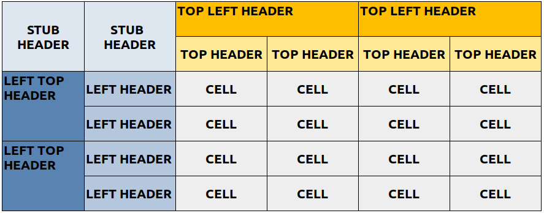

```{r message=FALSE, warning=FALSE, include=FALSE}
knitr::opts_chunk$set(
  collapse = TRUE,
  comment = "#>"
)
```

```{r message=FALSE, warning=FALSE, include=FALSE}
library(tidyverse)
library(mmtable2)
```

mmtable2 uses uses the following framework to constructing tables:

```{r,out.width = "500px", echo = FALSE}

```

The data required to create an mmtable is similar to the dataframe used for the ggplot2 package.   

This data frame has a:  

*  *row* for each *cell* 
*  *column* for each *header* 


Here's and example of such a data frame

```{r}
student_df
```

And here's an example of an mmtable constructed with this data

```{r}
student_df %>%
  mmtable(table_data = value) +
  header_top(student) +
  header_top(grade) +
  header_left(class) +
  header_left_top(subject)
```

